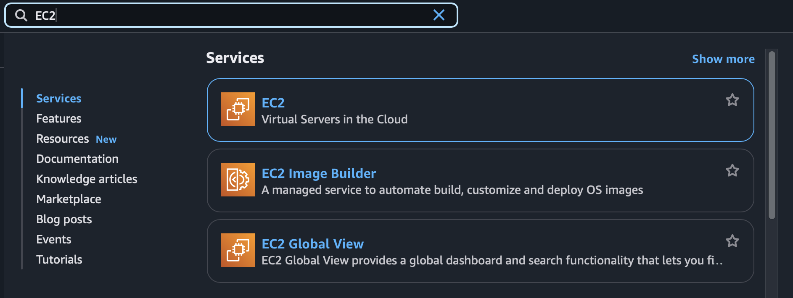
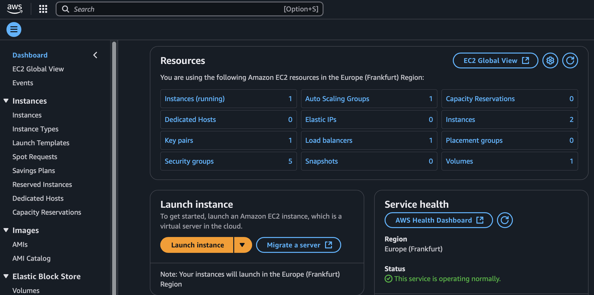

# Setting up the environments for ML Zoomcamp 2024

Last updated 25.09.2024

We need for the course:

- [Python 3.11](https://docs.python.org/3.11/ "Python 3.11 Docs") (note that videos use 3.8)
- [NumPy 1.26.4 Release date: 5 Feb, 2024](https://numpy.org "NumPy") (NumPy 2 only works with Python 3.13), [pandas 2.2.3 Release date: 20 Sep 20, 2024](https://pandas.pydata.org "pandas") and [scikit-learn 1.5.2 Release date: Sep, 2024](https://scikit-learn.org/stable/ "scikit-learn") (latest available versions)
- [matplotlib 3.9.2 Release date: 12 Aug, 2024](https://matplotlib.org "matplotlib") and [seaborn 0.13.2 Jan, 2024](https://seaborn.pydata.org "Seaborn")
- [Jupyter notebooks](https://jupyter.org "Jupyter notebooks")

In this section, I'll describe how I prepared my local and remote environments for the course.

## Setup Conda Environment on MacBook 13", M1, 2020, 16GB  with Apple Silicon (arm64) running on Sonoma 14.7

I use a MacBook Pro 13" with Apple Silicon (arm64) and VSCode as my main editor. I use Conda as my environment manager and created a dedicated environment for the course. I also installed some additional software that I find useful, but that is described in a separate [post](./01_setup_macBook.md "Setup MacBook"). I know macOS 15 was just released, but I prefer to wait a bit before upgrading my system.

- First install [🍺 Homebrew](https://brew.sh "🍺 Homebrew") as a package manager for macOS, in `Terminal.app` run:

```bash
/bin/bash -c "$(curl -fsSL https://raw.githubusercontent.com/Homebrew/install/HEAD/install.sh)"
```

- Install  `iterm2`, `miniforge`, `visual-studio-code` and `zoom` as your basic requirements:

```bash
brew install iterm2 miniforge visual-studio-code zoom
```

**Caveat**: brew install conflict with docker desktop and command line tools. You need to install docker desktop first and then the command line tools. [Issue](https://github.com/Homebrew/brew/issues/16309)

- When installing docker with brew, if you want to install [docker desktop](https://www.docker.com/products/docker-desktop/), you need to run the following command:

```bash
brew install --cask docker
```

- Then install the following packages:

```bash
brew install docker docker-compose
```

[How to shrink packages for dockerization](https://towardsdatascience.com/how-to-shrink-numpy-scipy-pandas-and-matplotlib-for-your-data-product-4ec8d7e86ee4)

### [iTerm2](https://iterm2.com "iTerm2")

I use iTerm2 as my terminal emulator and installed [Oh My Zsh](https://ohmyz.sh "Oh My Zsh") as plugin manager for zsh. I also installed some plugins and themes that I find useful, but I`ll describe this in a separate [post](./02_setup_iterm2.md "Setup iTerm").

### [Miniforge](https://github.com/conda-forge/miniforge)

This is a minimal installer for Conda specific to conda-forge. It is a small, bootstrap version of Anaconda that includes only conda, Python, the packages they depend on, and a small number of other useful packages, including pip, zlib and a few others. I created a dedicated [environment.yml](../../environment.yml) for the course.

To create this `ML_Zoomcamp2024` conda environment from the file run the following command in the folder containing this file:

```bash
conda env create -f environment.yml
```

Activate the environment with the following command:

```bash
conda activate ML_Zoomcamp2024
```

This installs the most important libraries for data science and needed for the course:

- Python=3.11
- NumPy, Pandas and Scikit-Learn (latest available versions)
- Matplotlib and Seaborn
- Jupiter notebooks

I also added some additional libraries (some needed for later in the course):

- [PyTorch](https://pytorch.org), Torchaudio, Torchvision,
- [SciPy](https://scipy.org), [xgboost](https://xgboost.readthedocs.io/en/stable/)
- [Tensorflow=2.14](https://www.tensorflow.org), [Tensorflow-metal=1.1.0](https://developer.apple.com/metal/tensorflow-plugin/)
- [Flask](https://flask.palletsprojects.com/en/3.0.x/), [gunicorn](https://gunicorn.org), [grpcio](https://grpc.io), [requests](https://docs.python-requests.org/en/latest/index.html), [tqdm](https://tqdm.github.io)
- [black](https://black.readthedocs.io/en/stable/index.html), [isort](https://pycqa.github.io/isort/), [pylint](https://www.pylint.org), [ruff](https://docs.astral.sh/ruff/)

I still need to test the installation of other libraries required later in the course .

- [ ] [pytest]() still missing
- [ ] [pickel-mixin]() still missing
- [ ] [pipenv]() still missing
- [ ] [poetry]() still missing
- [ ] what else?

Tensorflow and [PyTorch](https://developer.apple.com/metal/pytorch/) are installed with Metal GPU support for Apple Silicon (arm64) Macs. You can test the installation with this [notebook](./apple_metal_test_env.ipynb)

For me the output looks like this, so everything is installed correctly:

```plaintext
Python 3.11.10 | packaged by conda-forge | (main, Sep 22 2024, 14:11:13) [Clang 17.0.6 ]
Python Platform: macOS-14.7-arm64-arm-64bit

Pandas 2.2.2
NumPy 1.26.4
Scikit-Learn 1.5.1
SciPy 1.14.1

Tensor Flow Version: 2.14.0
Keras Version: 2.14.0
GPU is available

PyTorch version: 2.4.1
Is MPS (Metal Performance Shader) built? True
Is MPS available? True
Using device: mps
```

[Managing Python on macOS — The Clean Way](https://raycent.medium.com/managing-python-on-macos-the-clean-way-7673cab874f6)

[How to use pyenv to manage Python versions](https://blog.teclado.com/how-to-use-pyenv-manage-python-versions/)

[Managing Multiple Python Versions With pyenv](https://realpython.com/intro-to-pyenv/)

[PyEnv: Managing Multiple Python Versions With Ease](https://python.land/virtual-environments/pyenv)

[Python venv: How To Create, Activate, Deactivate, And Delete](https://python.land/virtual-environments/virtualenv)

[python env 101](https://freedium.cfd/towardsdatascience.com/python-environment-101-1d68bda3094d)

[pipenv vs conda](https://towardsdatascience.com/pipenv-vs-conda-for-data-scientists-b9a372faf9d9)

[when and how to use Conda, Pipenv, Virtualenv, Pip, and Poetry](https://medium.com/@maheshkarthu/understanding-when-and-how-to-use-conda-pipenv-virtualenv-pip-and-poetry-is-crucial-for-2a518a951945)

[Using Pipenv to Manage Python Packages and Versions](https://www.linode.com/docs/guides/manage-python-environments-pipenv/)

[Managing Application Dependencies](https://packaging.python.org/en/latest/tutorials/managing-dependencies/)

[Virtualenvs with Pyenv](https://medium.com/hackerculture/setting-up-python-3-11-and-virtualenvs-with-pyenv-47f480965e75)

[Stop using Pip, use Poetry Instead!](https://nanthony007.medium.com/stop-using-pip-use-poetry-instead-db7164f4fc72)

#### Python Package Managers
To get an overview of the different package managers for Python, I created a table with the most important commands and differences. It is not complete (brew, venv and virtualenv are missing), but it should give you a good overview of the most important package managers and their commands.

|manager|[pip](https://pypi.org/project/pip/)|[conda](https://docs.anaconda.com "Docs Anaconda") / [miniforge](https://conda-forge.org/docs/ "conda-forge")|[pyenv](https://github.com/pyenv/pyenv)|[Pipenv](https://pipenv.pypa.io/en/latest/)|[Poetry](https://python-poetry.org)|
|---|---|---|---|---|---|
|type of manager| packages|packages / virtual environments|python version management|virtualenv management|dependency management<br> and packaging|
|install manager|installed with your Python|`brew install miniforge`|`brew install openssl readline sqlite3 xz zlib && brew install pyenv`|needs Python and pip:<br>`pip install pipenv --user`<br>**Note:** Homebrew installation is discouraged because it works better to install pipenv using `pip` on macOS.|requires Python 3.8+, in your venv (created with `python -m venv .venv`), run `pip install -U pip setuptools && pip install poetry`; for tab completion `mkdir $ZSH_CUSTOM/plugins/poetry && poetry completions zsh > $ZSH_CUSTOM/plugins/poetry/_poetry`; add `poetry` to plugins in `~/.zshrc` |
|upgrade manager|`pip install --upgrade pip`|`conda update -n base -c conda-forge conda`|`brew upgrade --greedy && brew cleanup`|`pip install --user --upgrade pipenv`|`pip install --upgrade poetry`|
|list available<br>python versions|use [PiPy](https://pypi.org/search) (via a browser)|`conda search python`|`pyenv install --list`|||
|install spec.<br>python version||`conda install python==<VERSION>`|`pyenv install <VERSION>`|`pipenv install python==<VERSION>`;<br> Automatically installs required Python version when `pyenv` is available.||
|set spec.<br>python version||define in `requirements.yml`|`pyenv local <VERSION>`, creates `.python-version`-file|Automatically installs required Python version when `pyenv` is available.||
|create env||`conda create -n <ENV_NAME>`|`python -m venv .venv`|created when installing package, creates `Pipfile` & `Pipfile.lock`|`python -m venv .venv`|
|create env<br>from file|`pip install -f requirements.txt`|`conda env create -f environment.yml`|`pip install -f requirements.txt`|`pipenv install`; `Pipfile` needed||
|activate env||`conda activate <ENV_NAME>`|`source .venv/bin/activate`|`pipenv shell`|`poetry shell`|
|install package|`pip install <package>`|`conda install <package>` or `pip install <package>`|`pip install <package>`|`pipenv install <package>`||
|create env file with installed packages|`pip freeze > requirements.txt`|`conda env export --name <ENV_NAME> > environment.yml`|`pip freeze > requirements.txt`|||
|deactivate env||`conda deactivate`|`deactivate`||`deactivate`|
|delete env||`conda env remove --name <ENV_NAME>`|`pyenv uninstall <ENV_NAME> && rm .python-version`|||

### [Visual Studio Code](https://code.visualstudio.com "Visual Studio Code")

I use VSCode as my main editor and installed some extensions that I find useful, but I`ll describe this in a separate [post](./03_setup_vscode.md).

### [Zoom](https://zoom.us "Zoom")

Well, this is called ML_Zoomcamp, so I installed Zoom for the course, although it is not needed for the course itself. But as suggested in the course, there are slack channels and a telegram group for communication. So I installed [Slack](https://slack.com "Slack") and [Telegram](https://telegram.org "Telegram") as well.

```bash
brew install slack telegram
```

## Ubuntu 24.04 on AWS EC2

Also I created an Ubuntu 24.04 x86_64 instance on AWS EC2 with a conda environment for the course and setup port forwarding to access Jupyter server with VSCode (Remote-SSH).

The video suggested installing Ubuntu 22.04, but I prefer to use the latest LTS version.

The Python version installed with Ubuntu 24.04 is 3.12.5.

Hopefully I will not run into problems with running code locally on Apple Silicon (arm64) and remotely on x86_64. But as pointed out in the video, I can create an arm64 instance on AWS as well.

I'm wondering if there is a more convenient way to connect to the Jupyter server without copying the IP address manually into the `.ssh/config`. If you have any simple suggestion please let me know. --> ddclient

I try to create an `.dotfile`-repository with all my configurations and settings, but I'm not sure if I find the time to collect all nessesary configuration files. Can you recommend tools like [stow](https://www.gnu.org/software/stow/) or do you have any better suggestions? How do you manage your configuration files efficiently to sync them between different machines?

FIXME: Needs recreation for GPU support.

- clone `machine-learning-zoomcamp` and `ML_Zoomcamp2024_hw`
- install Miniforge3-24.7.1-0-Linux-x86_64.sh, docker.io, docker-compose, zsh, oh-my-zsh, zsh-autosuggestions, zsh-syntax-highlighting, zsh-completions, zsh-autopair, eza, powerlevel10k, fzf, bat, fd, ripgrep, extract, poetry, pyenv, 

## Other Cloud Environments

Last I have accounts for [kaggle](https://www.kaggle.com/ "kaggle") and [Google Colab](https://colab.research.google.com/ "Google Colab") for running notebooks in the cloud.

With all these environments I should be well prepared for the course. For me the most exiting part was creating my first EC2 instance on AWS (it worked without a credit card here in germany).

## Update for [Renting a server on AWS](https://mlbookcamp.com/article/aws-ec2) for MLzoomcamp 2024

This article covers:

Creating the right EC2 instance
Connecting to the instance
Shutting it down

We’ll show how to do it on AWS and create an EC2 (Elastic Compute Cloud) machine on AWS. EC2 is part of AWS and allows you to rent a server of any configuration for any duration of time.

To use AWS, you need to have an AWS account. If you don’t have an account yet, see [Creating an AWS account](https://mlbookcamp.com/article/aws).

### Creating an EC2 instance

EC2 is a service for renting a machine from AWS. You can use it to create a Linux machine to run Jupyter notebook and experiment with machine learning.

To do this, first go to the EC2 page in AWS. The easiest way to do this is by typing “EC2” in the “Find Services” box on the home page of the AWS Management Console; select “EC2” from the drop-down list and press “Enter”:



> [!NOTE]
> The screenshots were taken in Dec 2024. It’s possible that the content on the AWS web site and the appearance of the management console changed since then.

On the EC2 page, choose “Instances” from the menu on the left and then click “Launch Instance”:



This brings you to a six-step form.

1. The first step is to specify the AMI (Amazon Machine Image) you’ll use for the instance. We recommend Ubuntu: it’s one of the most popular Linux distributions and we used it for all the examples in this book. Other images should also work fine, but we haven’t tested them.

At the time of writing, Deep Learning OSS Nvidia Driver AMI GPU TensorFlow 2.17 (Ubuntu 22.04) is available, so use that one: find it in the list and then click “Select”.


Also note that this AMI is “Free tier eligible,” which means that if you use the free tier for testing AWS, you won’t be charged for using this AMI.
