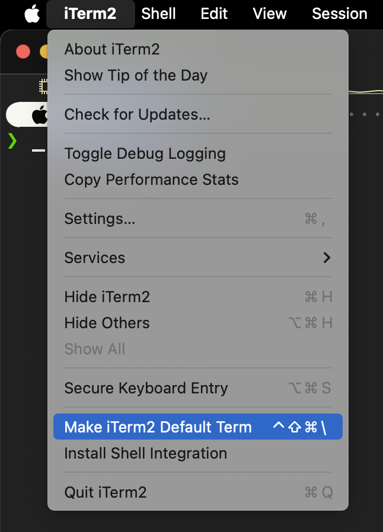
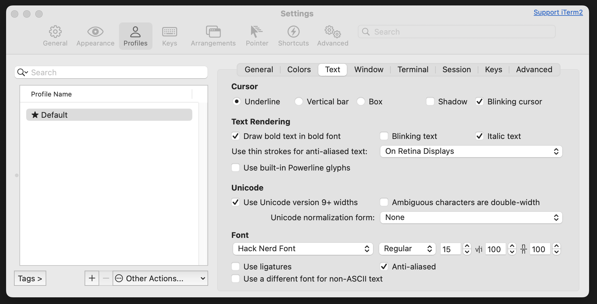
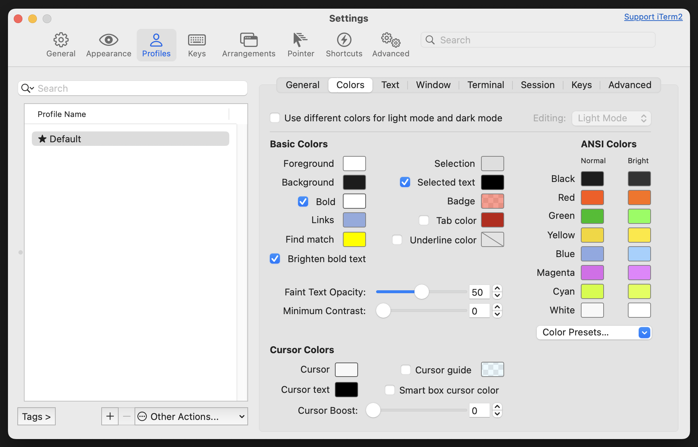
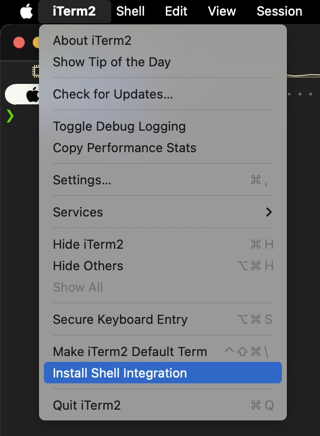
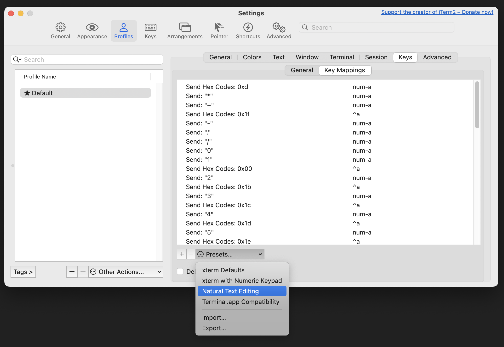
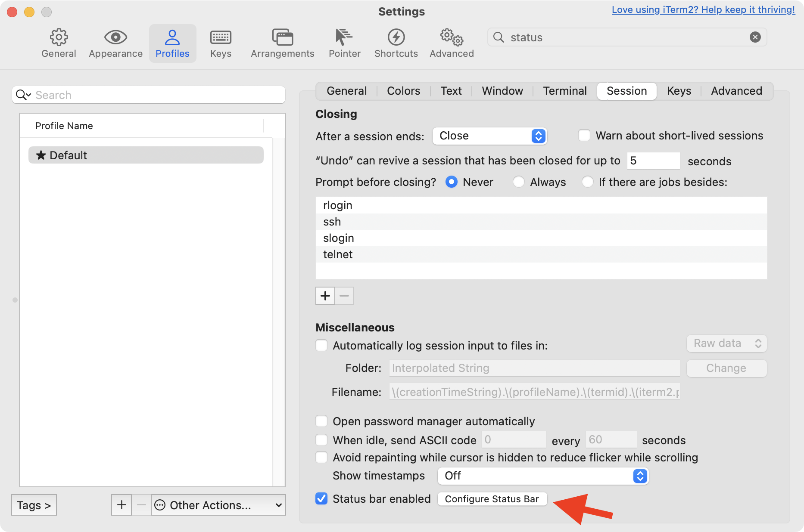
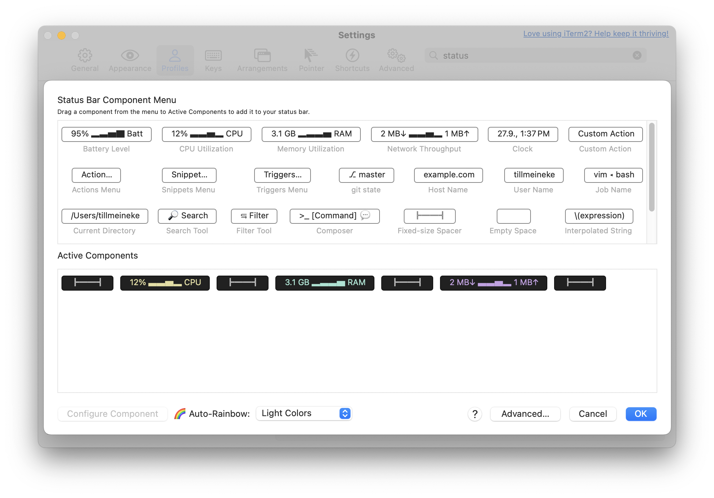
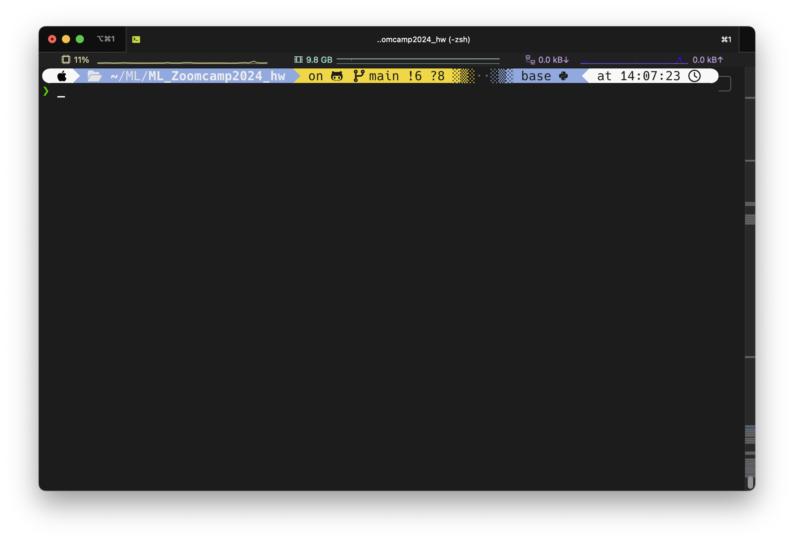

# Costumize your Terminal for ML Zoomcamp 2024

- Homebrew
- [iterm2](https://iterm2.com): a better terminal
  - [font-hack-nerd-font](https://www.nerdfonts.com): a nice font in the terminal
  - [SpaceCamp](https://github.com/reobin/spacecamp-iterm) color scheme
  - shell integration
  - key bindings
  - status bar
- [oh-my-zsh](https://ohmyz.sh)
  - [zsh-autosuggestions](https://github.com/zsh-users/zsh-autosuggestions), [zsh-syntax-highlighting](https://github.com/zsh-users/zsh-syntax-highlighting): zsh shell plugins for command suggestions and syntax highlighting
  - prompt theme: [powerlevel10k](https://github.com/romkatv/powerlevel10k)
  - other plugins
- other tools: `bat`, `eza`, `fzf`, `tree`, `boxes`, `figlet`, `toilet`, `tldr`, `cht.sh`
- Keyboard shortcuts
- fun: `cowsay`, `lolcat`, `fortune`, `sl`, `nyancat`, `cmatrix`, `pipes.sh`, `asciiquarium`, `bb`

Pimp up your terminal to make life easier and more fun. You will even be more efficient and productive during the zoomcamp.

**WARNING**: I am not sure if it works for older versions of macOS. I am using macOS Sonoma 14.7.

This is a rabbit hole. You can spend hours and hours customizing your terminal. But it is worth it. You will spend a lot of time in the terminal. So make it a nice place to be.

## Install Homebrew

Homebrew is a free and open-source software package management system for macOS. It simplifies the installation of software on Apple's macOS operating system. You can install Homebrew by running the following command in your terminal:

```sh
/bin/bash -c "$(curl -fsSL https://raw.githubusercontent.com/Homebrew/install/HEAD/install.sh)"
```

It shows you some commands to run. Follow them.

```sh
echo 'eval "$(/opt/homebrew/bin/brew shellenv)"' >> ~/.zprofile
eval "$(/opt/homebrew/bin/brew shellenv)"
```

On linux use your package manager to install software. On your AWS Ubuntu instance, you can use `apt-get` to install software. Remember to update your package manager before installing software.

```sh
sudo apt-get update

# or on macOS
brew update && brew outdated
```

Standard shell in macOS is `zsh` in Ubuntu it is `bash`.

Change shell to `zsh`:

```sh
chsh -s /bin/zsh -u $USER
```

## Install [iterm2](https://iterm2.com/):

iTerm2 is a powerful terminal emulator for macOS. It has a lot of features that make your life easier. You can install it with Homebrew:

```sh
brew install --cask iterm2
```

Next make iTerm your default terminal. You can do this by going to `iTerm2 -> Make iTerm2 Default Term` in the menu.

<div style="text-align:center;">
  
</div>

### Install [font-hack-nerd-font](https://www.nerdfonts.com/)

To display icons and glyphs in the terminal, you need to install a font that supports them. I recommend for the ML Zoomcamp the Hack Nerd Font. You can install it with Homebrew:

```sh
brew install --cask font-hack-nerd-font
```

You have to set it in iTerm2. Go to `iTerm2 -> Preferences -> Profiles -> Text -> Font -> Change Font` and select the `Hack Nerd Font` and set size to 15.



### Color schemes

You can find a lot of color schemes for iTerm2 on the internet. I recommend the [iTerm2 Color Schemes](https://iterm2colorschemes.com/) website. You can download the color schemes and import them into iTerm2.

<!-- I use the [Dracula+](https://raw.githubusercontent.com/mbadolato/iTerm2-Color-Schemes/master/schemes/Dracula+.itermcolors)-color scheme. -->

I found a nice color scheme called [SpaceCamp](https://github.com/reobin/spacecamp-iterm), which fits perfectly for the ML Zoomcamp.



### Shell integration

iTerm2 has a feature called shell integration that allows you to use the terminal more efficiently. You can enable it in the menu `iTerm2 -> Install Shell Integration`.

<div style="text-align:center;">
  
</div>

You are asked if you'd like to install the Utilities Package as well. For example, this gives you `imgcat` and `imgls` to display inline images in the terminal.

### Key bindings

I prefere natural text editing: `iTerm2 -> Preferences -> Profiles -> Keys -> Key Mappings -> Presets -> Natural Text Editing`



This way you can use the same key bindings as in your text editor. Especially the `option` key is very useful for moving the cursor word by word with the arrow keys. You can also use `option + backspace` to delete a word.

### Status bar

I like to see the usage of my system in the status bar. You can enable it in `iTerm2 -> Preferences -> Profiles -> Session -> Status bar enabled`.



My settings for the status bar look like this:



I keep it on the top of the terminal window. You can add different components to the status bar. I like to see the CPU usage, memory usage, and network traffic in rainbow colors.

## Install [oh-my-zsh](https://ohmyz.sh/):

oh-my-zsh is a community-driven framework for managing your zsh configuration. It comes bundled with a ton of helpful functions, helpers, plugins, and themes. You can install it with the following command:

```sh
sh -c "$(curl -fsSL https://raw.githubusercontent.com/ohmyzsh/ohmyzsh/master/tools/install.sh)"
```

### [zsh-autosuggestions](https://github.com/zsh-users/zsh-autosuggestions) and [zsh-syntax-highlighting](https://github.com/zsh-users/zsh-syntax-highlighting)

zsh shell plugins for command suggestions and syntax highlighting

```sh
brew install zsh-autosuggestions zsh-syntax-highlighting
```

Add the following lines to your `.zshrc` file:

```sh
source /opt/homebrew/share/zsh-autosuggestions/zsh-autosuggestions.zsh
source /opt/homebrew/share/zsh-syntax-highlighting/zsh-syntax-highlighting.zsh
```

### prompt theme: [powerlevel10k](https://github.com/romkatv/powerlevel10k)

There are a lot of prompt themes for oh-my-zsh. I recommend the powerlevel10k theme. You can install it with the following command:

```sh
git clone --depth=1 https://github.com/romkatv/powerlevel10k.git ${ZSH_CUSTOM:-$HOME/.oh-my-zsh/custom}/themes/powerlevel10k
```

Set `ZSH_THEME="powerlevel10k/powerlevel10k"` in your `.zshrc` file.

It will ask you some questions to configure the prompt. You can always reconfigure it with `p10k configure`.

My Wizard options are: nerdfont-v3 + powerline, large icons, rainbow, unicode, 24h time, angled separators, blurred heads, round tails, 2 lines, dotted, right frame, light-ornaments, sparse, many icons, fluent, transient_prompt instant_prompt=verbose.

Your Terminal will look like this:



<!-- other prompt themes:
- [Starship](https://starship.rs/)
- [Spaceship]()
 -->

### [other plugins for oh-my-zsh](https://github.com/ohmyzsh/ohmyzsh/wiki/Plugins)

Check out other plugins for oh-my-zsh. You can install them with Homebrew or with `git clone` in the `~/.oh-my-zsh/custom/plugins` directory. Best read the documentation of the plugin first. Don't forget to include them in your `.zshrc` file

I use the following plugins:

- [brew](https://github.com/ohmyzsh/ohmyzsh/tree/master/plugins/brew) adds several aliases for common brew commands.
- [extract](https://github.com/ohmyzsh/ohmyzsh/tree/master/plugins/extract) defines a function called `extract` that extracts the archive file you pass it
- [git](https://github.com/ohmyzsh/ohmyzsh/tree/master/plugins/git) provides many aliases and a few useful functions
- [gitignore](https://github.com/ohmyzsh/ohmyzsh/tree/master/plugins/gitignore) enables you the use of [gitignore.io](https://www.toptal.com/developers/gitignore/) from the command line
- [macos](https://github.com/ohmyzsh/ohmyzsh/tree/master/plugins/macos) provides a few utilities to make it more enjoyable on macOS
- [poetry](https://github.com/ohmyzsh/ohmyzsh/tree/master/plugins/poetry) automatically installs Poetry's completions for you
- [vscode](https://github.com/ohmyzsh/ohmyzsh/tree/master/plugins/vscode) provides useful aliases to simplify the interaction between the command line and VS Code
- [web-search](https://github.com/ohmyzsh/ohmyzsh/tree/master/plugins/web-search) adds aliases for searching with Google, Wiki, Bing, YouTube and other popular services
- [zsh-autopair](https://github.com/hlissner/zsh-autopair) auto-closes, deletes and skips over matching delimiters in zsh intelligently. Hopefully.

## Other tools

- `eza` or `lsd`: for a modern `ls` replacement

- `bat`: syntax highlighting for cat

- `fzf`: fuzzy search

## Keyboard shortcuts

- Install
  - `btop`: a better `htop`
  - `htop`: a better `top`
  - `gtop`: a better `top`

[Terminal shortcuts](https://support.apple.com/guide/terminal/keyboard-shortcuts-trmlshtcts/mac)

[the-ultimate-guide-to-your-terminal-makeover](https://www.freedium.cfd/towardsdatascience.com/the-ultimate-guide-to-your-terminal-makeover-e11f9b87ac99)

FUN:

[Moo! There is a Cow in My Linux Terminal](https://itsfoss.com/cowsay/)

[Linux Terminal Commands With Cowsay](https://dev.to/dotbehrens/linux-terminal-commands-with-cowsay-515g)

[3 interesting ways to use the Linux cowsay command](https://opensource.com/article/21/11/linux-cowsay-command)

[Printing ASCII Art in the Shell](https://www.baeldung.com/linux/shell-printing-ascii-art)

[11 Fun Linux Command-Line Programs You Should Try When Bored](https://www.makeuseof.com/fun-linux-command-line-programs/)

[TOIlet](http://caca.zoy.org/wiki/toilet)

[Linux terminal highlights: Going beyond cowsay](https://www.redhat.com/sysadmin/beyond-cowsay)

BUG:

[iTerm2 mark misplaced in multiline prompt](https://github.com/romkatv/powerlevel10k/issues/1213)

[how to add $(iterm2_prompt_mark) after newline? - Starship](https://github.com/spaceship-prompt/spaceship-prompt/discussions/1036)

[OSC 133 support](https://github.com/romkatv/powerlevel10k/issues/1591)

## Not installed, but interesting

[zsh-autocomplete](https://github.com/marlonrichert/zsh-autocomplete)

## Have look later / usefull links

[Get the best out of the Macbook Touchbar with iTerm2]

[An iTerm2 Cheatsheet]

[iTerm2 + Oh My Zsh! + Powerlevel10K best terminal combination for Geeks!]

[Get the best out of the Macbook Touchbar with iTerm2]: https://dev.to/yoanmalie/get-the-best-out-of-the-macbook-touchbar-with-iterm2-1001
[An iTerm2 Cheatsheet]: https://gist.github.com/squarism/ae3613daf5c01a98ba3a
[iTerm2 + Oh My Zsh! + Powerlevel10K best terminal combination for Geeks!]: https://dev.to/equiman/iterm2--oh-my-zsh--powerlevel9k-best-terminal-combination-for-geeks-58l5