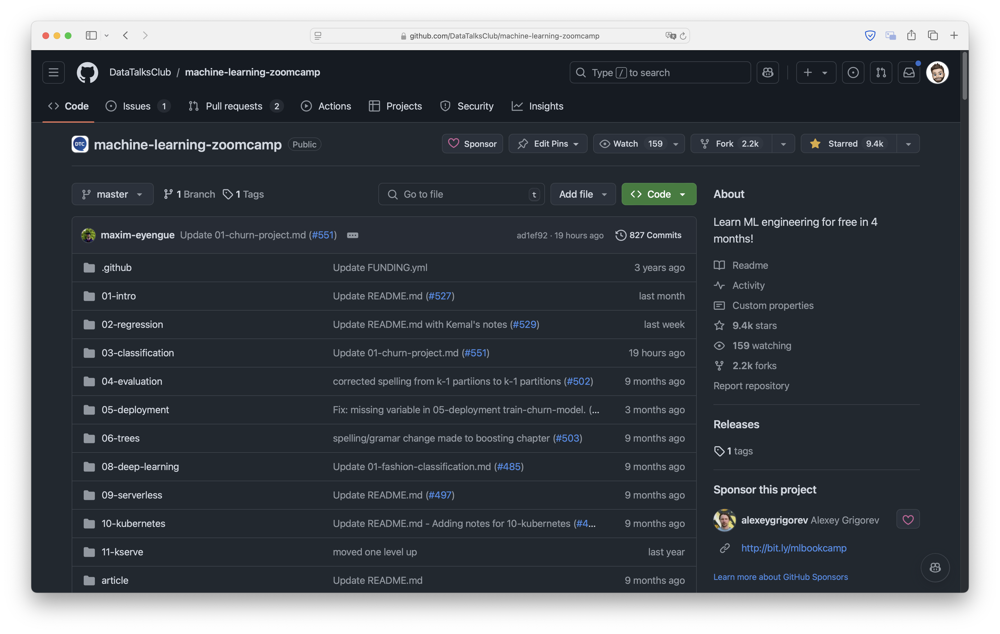
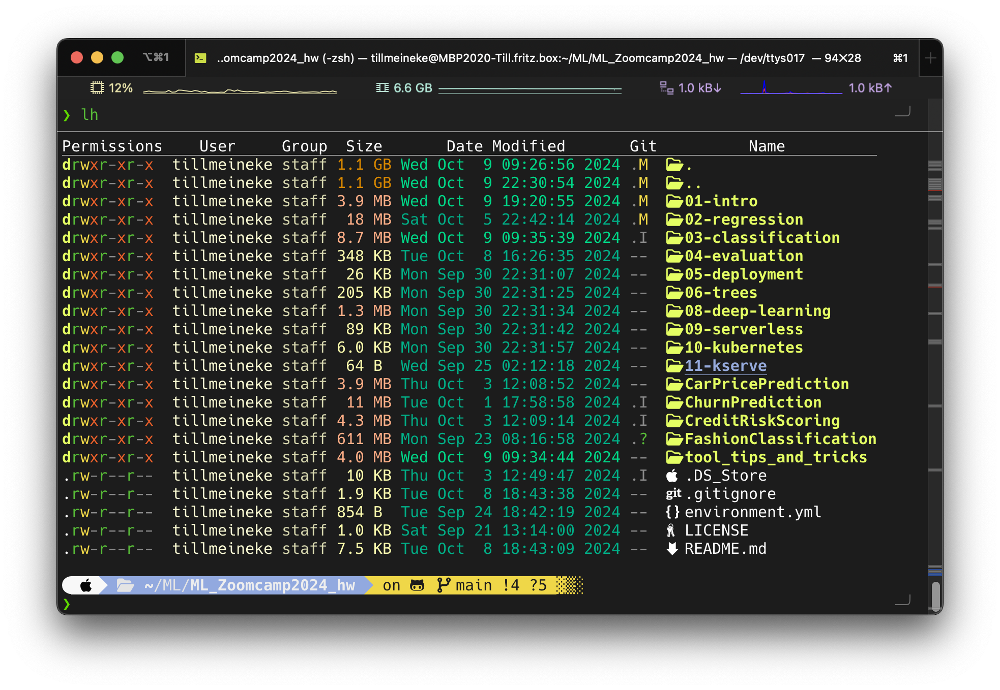

# How to Keep Up with the ML Zoomcamp 2024

## TL;DR

The ML Zoomcamp 2024 offers a self-paced online learning experience in machine learning. To succeed, focus on learning Git/GitHub, mastering the command line, utilizing your IDE effectively, building Python skills, engaging on Slack, and using LLMs wisely. Connect with the community, tackle homework assignments, and manage your time effectively to keep up with the course.

---

- [How to Keep Up with the ML Zoomcamp 2024](#how-to-keep-up-with-the-ml-zoomcamp-2024)
  - [TL;DR](#tldr)
  - [Introduction](#introduction)
  - [1. Mastering Git and GitHub](#1-mastering-git-and-github)
  - [2. Working Remotely and Mastering the Command Line](#2-working-remotely-and-mastering-the-command-line)
  - [3. Learn Python and Essential Tools](#3-learn-python-and-essential-tools)
  - [4. Maximizing Your IDE’s Potential](#4-maximizing-your-ides-potential)
  - [5. Setting Up Your Workspace, Shortcuts, and Cheatsheets](#5-setting-up-your-workspace-shortcuts-and-cheatsheets)
    - [Setting Up Your Workspace](#setting-up-your-workspace)
    - [Shortcuts](#shortcuts)
    - [Cheatsheets](#cheatsheets)
  - [6. Engage on Slack and Learn in Public](#6-engage-on-slack-and-learn-in-public)
  - [7. Use LLMs and Coding Assistants Wisely](#7-use-llms-and-coding-assistants-wisely)
  - [8. Hands-on Practice and Reinforcing Concepts](#8-hands-on-practice-and-reinforcing-concepts)
  - [9. Importance of Keeping Pace](#9-importance-of-keeping-pace)

## Introduction

The ML Zoomcamp 2024 is a self-paced online course designed to teach the fundamentals of machine learning. It's open to learners at any level, offering a flexible way to dive into the world of ML. Here I share my insights on how to make the most of the course and stay on track.

The 2024 cohort kicked off in September, and to get the most out of the course, it's recommended to sign up at DataTalks.Club and join the Slack channel for the course. This is where you can ask questions, collaborate with others, and stay updated on course events. Each week, there are homework assignments to reinforce your understanding, and both midterm and final capstone projects to measure your progress.

While you can go at your own pace, it's important to keep up with the materials to successfully complete the weekly homework and projects. In this guide, you'll find key strategies to stay on track and make the most of the ML Zoomcamp 2024.

## 1. Mastering Git and GitHub

In the ML Zoomcamp, you'll be working with code constantly, and learning Git and GitHub is essential for managing your projects effectively. Git allows you to track changes in your code, collaborate with others, and keep your work organized. GitHub, on the other hand, is a platform where you can store your Git repositories, share your projects publicly or privately, and collaborate with others in real time.

To stay on top of the course, it's important to:

- **Version control your homework and projects:** You can use Git to track changes, so if you make a mistake, you can easily revert to a previous version.
- **Collaborate with others:** GitHub makes it easy to work with classmates, get feedback, or even contribute to others' projects.
- **Showcase your work:** Your GitHub profile can act as an online portfolio. By uploading your ML Zoomcamp projects, you can demonstrate your skills to potential employers or collaborators.
- **Contribute to the course material:** As a participant, you have the opportunity to make pull requests on the official course repository to suggest updates or improvements to the materials. This is a great way to engage with the community and contribute to the course.

By mastering Git and GitHub early on, you'll save time and avoid potential headaches when managing your code throughout the course.

## 2. Working Remotely and Mastering the Command Line

Being comfortable with the command line is a crucial skill for anyone taking the ML Zoomcamp. Many tools and frameworks used in machine learning operate more efficiently through the command line interface (CLI) than through graphical user interfaces (GUIs).

Here’s why you should invest time in learning the command line:

- **Navigate your system easily:** The command line allows you to quickly navigate through directories and files, making it easier to locate your project files and datasets.
- **Run scripts and manage environments:** You’ll often need to run Python scripts, manage virtual environments, and install packages, all of which can be done quickly through the command line.
- **Access powerful tools:** Many data science and machine learning tools are primarily command-line based. Familiarity with the CLI will enable you to leverage these tools effectively.
- **Boost productivity:** Once you’re comfortable with command line commands, you can perform tasks much faster than clicking through menus, which can significantly enhance your productivity.
- **Work remotely:** When working on cloud platforms like AWS or other cloud providers, you often won’t have access to a GUI. Being proficient in the command line is essential for managing your resources and running your ML tasks effectively in these environments.

To get started, you can find many online resources and tutorials that teach the basics of the command line. As you progress through the ML Zoomcamp, continue to practice and use the command line regularly to build your confidence and efficiency.

## 3. Learn Python and Essential Tools

Python is the primary programming language used throughout the ML Zoomcamp. Here’s why you should focus on enhancing your Python skills and learning essential tools:

- **Widely used in machine learning:** Python is crucial for implementing machine learning algorithms and workflows.
- **Rich ecosystem of libraries:** Familiarize yourself with libraries like NumPy, Pandas, Matplotlib, and scikit-learn, which are vital for machine learning.
- **Practice through projects:** Apply your Python knowledge through hands-on projects as you progress through the course.
- **Version control with Git and GitHub:** Learn to manage your code, collaborate with others, and prepare for real-world development practices.
- **Utilize your IDE effectively:** Choose and master an Integrated Development Environment (IDE) to boost your productivity by learning keyboard shortcuts, using debugging tools, and leveraging built-in features for code completion and refactoring.

While the course provides basic Python knowledge, exploring additional resources and practicing regularly will further enhance your skills.

## 4. Maximizing Your IDE’s Potential

A good IDE can significantly improve your coding experience in the ML Zoomcamp. Here’s how to make the most of your IDE:

- **Code completion and linting:** Use code completion features to write code faster and reduce errors. Linting tools analyze your code for potential issues and suggest real-time improvements.
- **Debugging tools:** Take advantage of built-in debugging tools to set breakpoints, inspect variables, and step through your code line by line, making troubleshooting more manageable.
- **Version control integration:** Most IDEs support Git integration, allowing you to manage version control directly within the development environment for easy commits and conflict resolution.
- **Extensions and plugins:** Explore extensions that enhance your IDE’s functionality, such as those for Jupyter notebooks, data visualization, or machine learning libraries, to save time and improve your workflow.
- **Customization:** Tailor your IDE settings to fit your coding style by adjusting themes, keybindings, and layouts for a better working environment on your ML projects.

By fully utilizing your IDE and its extensions, you can create a more productive and enjoyable coding environment, which is essential for success in the ML Zoomcamp.

## 5. Setting Up Your Workspace, Shortcuts, and Cheatsheets

Creating a productive workspace is essential for staying focused and organized throughout the ML Zoomcamp. Here are some tips to set up your workspace and leverage shortcuts and cheatsheets effectively:

### Setting Up Your Workspace

- **Choose the Right Environment**: Depending on your workflow, select an IDE or code editor that suits your needs. In the ML zoomcamp we use Jupyter Notebook, Visual Studio Code, Google Colab or Kaggle. Customize the layout and themes to make it visually appealing and comfortable to work in.
- **Organize Your Files**: Create a dedicated folder structure for your projects, homework, and resources. Keep related files together, and use descriptive names for easy identification.
- **Install Useful Extensions**: Many IDEs offer extensions that enhance functionality. For example, Python support, linting tools, and Git integration can streamline your workflow.
- **Dual Monitor Setup**: If possible, consider using a dual monitor setup. This allows you to watch course videos on one screen while coding along on the other. It can significantly enhance your learning experience by enabling you to follow along with the material without constantly switching windows.

### Shortcuts

- **Familiarize Yourself with Keyboard Shortcuts**: Learning keyboard shortcuts for your IDE can significantly speed up your coding process. Look for a list of shortcuts specific to your editor, and practice using them regularly.
- **Create Custom Shortcuts**: If your IDE allows it, consider setting up custom shortcuts for frequently used commands to save time.
- **Snippets**: Utilize code snippets for frequently used code blocks to improve your efficiency.

### Cheatsheets

- **Utilize Cheatsheets**: Cheatsheets can be incredibly helpful for quick references. Look for cheatsheets specific to Python, machine learning libraries (like scikit-learn, Pandas, and NumPy), and Git commands.
- **Create Your Own Cheatsheets**: As you progress through the course, create personalized cheatsheets that summarize key concepts, syntax, and commands. This can serve as a quick reference and reinforce your understanding.

By effectively setting up your workspace, utilizing shortcuts and cheatsheets, and considering a dual monitor setup, you’ll create an environment conducive to learning and improve your efficiency in completing assignments and projects.

## 6. Engage on Slack and Learn in Public

One of the best ways to enhance your learning experience in the ML Zoomcamp is to actively engage with the community, particularly through Slack. Here's why connecting with others can be invaluable:

- **Ask questions and get support**: Don't hesitate to ask questions in the #course-ml-zoomcamp channel. You can always reach out to the @ZoomcampQABot for quick answers, or your tutors will be there to help as well.
- **Share your progress**: Learning in public means sharing your journey, including challenges and successes. By posting updates on your projects or discussing what you've learned, you encourage others and create a supportive environment.
- **Collaborate with others**: Find classmates who are working on similar projects or topics. Collaborating can lead to new insights, enhance your skills, and make the learning process more enjoyable.
- **Receive feedback**: Use the community to get feedback on your work. Constructive feedback can help you improve and refine your skills.
- **Networking opportunities**: Engaging with fellow participants can lead to networking opportunities for future collaborations or job prospects.

## 7. Use LLMs and Coding Assistants Wisely

Leveraging Large Language Models (LLMs) and coding assistants can be a game changer for your journey in the ML Zoomcamp. However, it's essential to use these tools wisely:

- **Get quick answers**: LLMs can provide fast responses to coding questions, explain concepts, and generate code snippets. This can save you time and help you overcome roadblocks more efficiently.
- **Enhance your understanding**: While these tools can assist you, it's crucial to understand the underlying principles and not rely solely on them. Use LLMs to complement your learning, not replace it.
- **Experiment with code**: Coding assistants can help you prototype ideas quickly, but make sure to review and understand the generated code before using it.
- **Develop problem-solving skills**: Work through problems on your own to build critical problem-solving skills, which are vital for a successful career in machine learning.

## 8. Hands-on Practice and Reinforcing Concepts

To truly master the material, it's crucial to go beyond just completing assignments:

- **Experiment with different algorithms and datasets**: Apply what you've learned to various scenarios to deepen your understanding.
- **Implement concepts from scratch**: This helps solidify your grasp of the underlying principles.
- **Participate in Kaggle competitions**: Apply your skills in real-world scenarios and learn from the community.
- **Review and reinforce regularly**:
  - Summarize key points after each module
  - Create flashcards for important terms and concepts
  - Teach concepts to others to solidify your understanding

## 9. Importance of Keeping Pace

Keeping pace is crucial in the ML Zoomcamp due to weekly homework and midterm and final capstone projects. Here are some tips to stay on track:

- Dedicate specific time each day to study.
- Break down homework tasks into manageable pieces.
- Use the Slack community for support and advice on homework challenges.
- Set realistic goals for each week.
- Create a study schedule that fits your lifestyle.
- Use productivity techniques like the Pomodoro method.

By managing your time effectively and maintaining a steady pace, you can tackle the course with confidence.

By incorporating these strategies, you'll be well-equipped to successfully navigate and keep up with the ML Zoomcamp 2024, building a strong foundation in machine learning along the way.

I must admit, I already absolved 2 bootcamps a 3 month in Data Analytics and Data Science. I am familiar with the tools and the workflow. I am looking forward to the ML Zoomcamp 2024 and the new challenges and insights it will bring, especially learning deployment of machine learning models.

I am excited to learn from the community and to share my knowledge and experience with others. I am confident that I will be able to keep up with the pace of the course and complete all the assignments and projects successfully. I am ready to embark on this new learning journey and make the most of this opportunity.

If you have any questions or suggestions, feel free to reach out to me or leave a comment below.

Let's do this! 🚀
