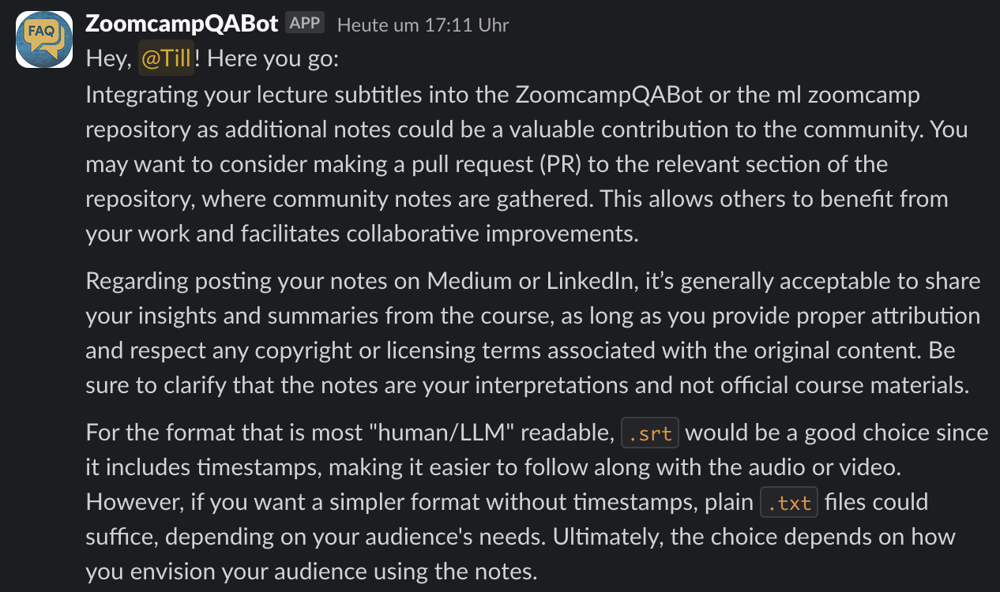

# Grab subtitles from videos from ML Zoomcamp youtube playlist

At the moment I am participating in the [ML Zoomcamp](https://github.com/DataTalksClub/machine-learning-zoomcamp) and in our Slack channel we were discussing how to keep pace with the lectures. My idea is to download the subtitles from the videos and convert them to text files. This way we can read the lectures in your own pace or integrate them into your own notes. It also makes the lectures text searchable.

Another possibility is to feed the subtitles into our Slack `@ZoomcampQABot` to get answers to questions about the lectures.

## Install [yt-dlp](https://github.com/yt-dlp/yt-dlp) to download subtitles

To quickly download subtitles from youtube videos, I installed `yt-dlp` on my machine.

on linux

```bash
pip install yt-dlp
```

on macOS

```bash
brew install yt-dlp
```

## Create a folder named `subs` and change to the directory

```bash
mkdir subs
cd subs
```

## List subtitles for playlist

You can change `url` to any youtube playlist, I selected the first video from the playlist and copied the `url`

```bash
yt-dlp --list-subs "https://www.youtube.com/watch?v=Jt2dDLSlBng&list=PL3MmuxUbc_hIhxl5Ji8t4O6lPAOpHaCLR"
```

Only auto-generated subtitles are available for the playlist

## Download auto-generated subtitles from playlist

```bash
yt-dlp \
--write-auto-subs \
--skip-download \
--sub-lang en \
"https://www.youtube.com/watch?v=Jt2dDLSlBnglist=PL3MmuxUbc_hIhxl5Ji8t4O6lPAOpHaCLR"
```

## Precleaning the subtitles

To clean the subtitles from timestamps and and doubling of lines I asked [ChatGPT](https://chatgpt.com "ChatGPT") to help me clean the subtitles. I provided ChatGPT with an raw exerpt of the subtitles and asked:

```plaintext
how do I convert this to plain text without timestamps an line
doubling, please provide python code
```

Running the script did not clean the subtitles as expected, so I had to ask again and provided a picture.


```plaintext
as you can see in your output there are still lot of doublings, please
look at the picture and analyse step by step how to avoid line
doubling
```

Since the code looked better, I asked ChatGPT in a second step:

```plaintext
can you add reading a whole directory of .vtt files and save to .txt
files?
```

ChatGPT gave me the following code, you can find in [clean_subs.py](./src/clean_subs.py). I just had to change the path to the directory with the .vtt files and the path to the directory where the .txt files should be saved.

```bash
python clean_subs.py
```

This gave me the cleaned subtitles in the `cleaned_subs` directory, but the subtitles were not structured, just one long string.


## Structured subtitles

To have a more structured subtitles, I asked ChatGPT again:

```plaintext
can we somehow keep some structure in txt file. like paragraphs,
or a extra line every 10 seconds?
```

ChatGPT provided my with [clean_subs_10xline.py](./src/clean_subs_10xline.py). Run it with:

```bash
python clean_subs_10xline.py
```


## Manual download of subtitles

This worked for the main playlist but not for the playlist with the Q&A sessions from 2022. So here I downloaded all files (28) manually.

```bash
yt-dlp \
--write-auto-subs \
--skip-download \
--sub-lang en \
"https://www.youtube.com/live/MqI8vt3-cag?si=TuTo5C9HXIClcNHZ"
```

For the Q&A sessions from 2023 and 2024, I downloaded the subtitles manually, as well.

## Inspection of subtitles

During inspection of all subtitles, I noticed that the subtitles for Sessions 5.4, 8.3, 9.2 and 9.4 were badly transcribed by YouTube.

I only downloaded the audio stream for those sessions.

First you can check for available formats, by running:

```bash
yt-dlp -F "https://youtu.be/Q7ZWPgPnRz8\?si\=j-zenjiHvikDtuR9"
```

Then you can download your desired audio stream (140 in my case) by running:

```bash
yt-dlp -f 140 "https://youtu.be/Q7ZWPgPnRz8\?si\=j-zenjiHvikDtuR9"
```

## Transcription with [Buzz](https://chidiwilliams.github.io/buzz/docs "Buzz documentation")

Buzz can transcribe and translate audio offline on your personal computer. You can import audio and video files and export transcripts to .txt, .srt, and .vtt.

I installed it with brew:

```bash
brew install --cask buzz
```

After adding a file to the queue, you will be prompted to select your model and the task you want to perform.


I used Buzz with Whisper(Large) model to transcribe the audio files to .txt, .srt and .vtt files.

Here you can see the result of the transcription of the audio files as .srt file:


Again the .txt file was just one long string, this still needs some cleaning.


## Conclusion

This was an easy and quick hack to download subtitles from youtube videos. The cleaning of the subtitles was a bit more challenging, but with the help of ChatGPT I was able to structure the subtitles in a more readable way.

Buzz was a great tool to transcribe the audio files to text files. The results were very good and I will use it in the future to transcribe more audio files. I think I have to tweak the settings a bit. I could try not using the best audio quality, and using a smaller model to speed up the process.

Our friendly @ZoomcampQABot thinks that the subtitles are a great idea to further enhance the learning experience in the ML Zoomcamp. It reminded me to "provide proper attribution and respect any copyright or licensing terms associated with the original content".



I asked Alexey Grigorev, the creator of the ML Zoomcamp, if it is ok to share this hack with the community and we are now organizing the integration of the subtitles into the @ZoomcampQABot. So stay tuned for more updates.
