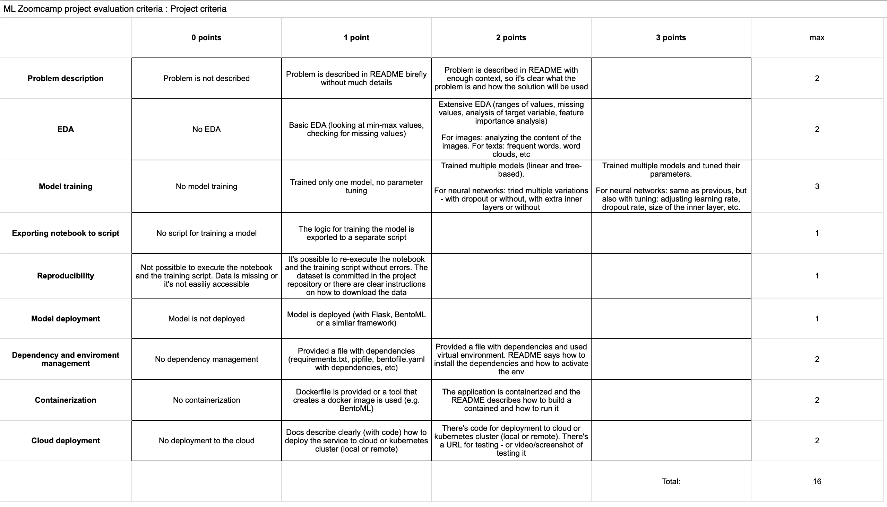

# helloDog: automagic dog recognition for daycare facilities

```plaintext
         _          _ _       _____
        | |        | | |     |  __ \
        | |__   ___| | | ___ | |  | | ___   __ _
        | '_ \ / _ \ | |/ _ \| |  | |/ _ \ / _` |
        | | | |  __/ | | (_) | |__| | (_) | (_| |
        |_| |_|\___|_|_|\___/|_____/ \___/ \__, |
                                            __/ |
                                           |___/
```

Start Date: October 11, 2024

Due Date: November 26, 2024 (00:00) - Midterm Project

## Problem Description

This project aims to automate dog registration and greeting processes in a dog daycare facility using computer vision.

**Imagine this scenario:** A dog arrives at the daycare. Traditionally, staff would manually note the dog's arrival on paper. With my system, the dog walks through an entrance equipped with a camera. The computer vision system instantly recognizes the dog, retrieves its profile, and displays a personalized welcome message on a screen. This not only streamlines the registration process but also provides a delightful welcome experience for both dogs and their owners.

This project utilizes deep learning techniques to train a model that can accurately recognize individual dogs in images. The trained model will be integrated into a user-friendly web interface, allowing daycare staff to manage dog profiles, upload new dog images, retrain the model for new dogs, and leverage the recognition system for registration purposes.

## Data

- **Dataset**:
  - A combination of publicly available dog image datasets (e.g., [ImageNet Dogs](http://vision.stanford.edu/aditya86/ImageNetDogs/main.html))
  - custom-collected images of dogs in the day care facility.
- **Data Structure**: Images of each dog are organized into separate folders within the `data/` directory.

## Model

- **Type**: Object Detection
- **Models**: YOLO, Faster R-CNN, SSD
- **Rationale**: These models are well-suited for real-time object detection tasks, making them suitable for recognizing individual dogs in images.

## Libraries and Frameworks

- **Python**: Primary programming language
- **Flask**: Web framework for creating the web interface
- **OpenCV**: Computer vision library for image processing and object detection
- **NumPy**: Numerical computations
- **Matplotlib/Seaborn**: Visualization (optional)

## Project Structure

```plaintext
helloDog/
├── README.md                  # This file
├── data/
│   ├── train/
│   │   ├── dog_1/
│   │   │   ├── image1.jpg
│   │   │   └── image2.jpg
|   |   |   └── ...
│   │   └── ...
│   ├── val/
│   │   ├── dog_1/
│   │   │   ├── image1.jpg
│   │   │   └── image2.jpg
│   │   └── ...
│   └── test/
│       ├── dog_1/
│       │   ├── image1.jpg
│       │   └── image2.jpg
│       └── ...
├── docs/
├── models/
│   └── model.h5             # Trained model file
├── notebooks/
├── scripts/
│   ├── data_preprocessing.py
│   ├── model_training.py
│   ├── model_evaluation.py
│   └── ...
├── web_interface/
│   ├── app.py
│   ├── templates/
│   │   └── index.html
│   └── static/
│       └── styles.css
├── requirements.txt        # File listing required Python libraries
├── ...                     # Other project files
```

## Project Plan and Timeline (4 weeks)

### Week 1: Data Preparation and EDA

- [ ] Collect and organize dog images dataset
- [ ] Perform data preprocessing (resizing, normalization)
- [ ] Conduct Exploratory Data Analysis (EDA)
- [ ] Analyze important features for dog recognition

### Week 2: Model Training and Selection

- [ ] Split dataset into training, validation, and test sets
- [ ] Train multiple models (YOLO, Faster R-CNN, SSD)
- [ ] Tune hyperparameters for each model
- [ ] Evaluate model performance and select the best model

### Week 3: Model Export and Web Service Development

- [ ] Export the notebook into `train.py` script
- [ ] Develop `predict.py` script for model inference
- [ ] Create a Flask web service for the model
- [ ] Implement a simple web interface for dog image upload and recognition

### Week 4: Containerization and Deployment

- [ ] Write Dockerfile for the web service
- [ ] Test the containerized application locally
- [ ] Deploy the service to a cloud platform (e.g., AWS, GCP, or Azure)
- [ ] Conduct final testing and documentation

## Deliverables



<!-- ## Missing

- inference on raspberry pi with camera
- inference on mobile devices
- capture of new dogs on mobile devices
- storage of recognized dogs in a database
- storage of new dog pictures in a database
- training on new dogs -->

<!--
# Individuelle Hundeerkennung

Dieses Projekt zielt darauf ab, 15-20 individuelle Hunde anhand von Bildern zu erkennen und ihnen Namen zuzuordnen.

## Projektübersicht

Das System verwendet maschinelles Lernen, um einzelne Hunde zu identifizieren und ihnen ihre entsprechenden Namen zuzuordnen. Es ist für den Einsatz in verschiedenen Umgebungen konzipiert, wie z.B. in Hundepensionen, Tierheimen oder für Hundebesitzer mit mehreren Hunden.

## Funktionen

- Erkennung von 15-20 individuellen Hunden
- Zuordnung von Namen zu erkannten Hunden
- Hohe Genauigkeit auch bei unterschiedlichen Lichtverhältnissen und Posen
- Automatisiertes Nachtraining bei neuen Hunden

## Technischer Stack

- Python 3.8+
- TensorFlow 2.x oder PyTorch
- OpenCV
- NumPy
- Pandas
- Flask oder FastAPI (für Backend-API)
- SQLite oder PostgreSQL (für Datenbankmanagement)

## Installation

1. Klonen Sie das Repository:
   ```bash
   git clone https://github.com/username/hunde-erkennung.git
   ```

2. Installieren Sie die erforderlichen Pakete:
   ```bash
   pip install -r requirements.txt
   ```

## Datensammlung

- Sammeln Sie 50-200 Bilder pro Hund
- Stellen Sie sicher, dass die Bilder verschiedene Posen, Lichtverhältnisse und Hintergründe abdecken
- Speichern Sie die Bilder in einem strukturierten Format:
  ```
  data/
  ├── hund1/
  │   ├── bild1.jpg
  │   ├── bild2.jpg
  │   └── ...
  ├── hund2/
  │   ├── bild1.jpg
  │   ├── bild2.jpg
  │   └── ...
  └── ...
  ```

## Modelltraining

1. Bereiten Sie die Daten vor:
   ```bash
   python prepare_data.py
   ```

2. Trainieren Sie das Modell:
   ```bash
   python train_model.py
   ```

3. Evaluieren Sie das Modell:
   ```bash
   python evaluate_model.py
   ```

## Verwendung

Um einen Hund zu erkennen, verwenden Sie:

```bash
python recognize_dog.py --image path/to/image.jpg
```

## Automatisiertes Nachtraining

Das System unterstützt automatisiertes Nachtraining, wenn neue Hunde hinzugefügt werden. Hier ist ein Beispiel für die Implementierung:

```python
def auto_fine_tune():
    new_data = check_for_new_data()
    if new_data:
        preprocessed_data = preprocess_data(new_data)
        updated_model = fine_tune_model(current_model, preprocessed_data)
        evaluate_and_save_model(updated_model)

# Regelmäßige Ausführung (z.B. als Cron-Job)
if __name__ == "__main__":
    auto_fine_tune()
```

Um diesen Prozess regelmäßig auszuführen, können Sie einen Cron-Job einrichten:

```bash
0 2 * * * /usr/bin/python3 /path/to/auto_fine_tune.py
```

Dies führt das Skript jeden Tag um 2 Uhr morgens aus.

## Beitrag

Beiträge sind willkommen! Bitte lesen Sie CONTRIBUTING.md für Details zum Prozess für Pull Requests.

## Lizenz

Dieses Projekt steht unter der MIT-Lizenz. Siehe LICENSE.md für weitere Details.

## Kontakt

Bei Fragen oder Anregungen kontaktieren Sie bitte [Ihr Name] unter [Ihre E-Mail-Adresse].
```

 -->
