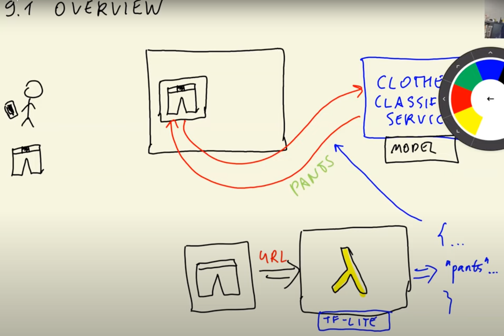
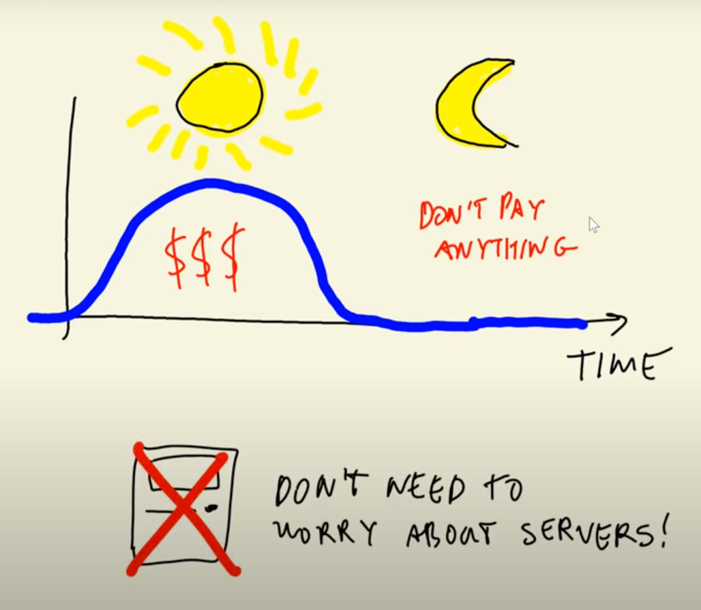

# Fashion Classification

## 8. TensorFlow and Keras

This week, we´ll learn about neural nets and build a model for classifying images of clothes.

## Multiclass Classification

Dataset:

- Full: [https://github.com/alexeygrigorev/clothing-dataset](https://github.com/alexeygrigorev/clothing-dataset)
- Small: [https://github.com/alexeygrigorev/clothing-dataset-small](https://github.com/alexeygrigorev/clothing-dataset-small)

Links:

- [https://cs231n.github.com](https://cs231n.github.com)

## 9. Serverless Deep learning

### 9.1 Introduction to Serverless

- Modul 9 covers serverless deep learning



### 9.2 AWS Lambda

- Intro to [AWS Lambda](https://eu-central-1.console.aws.amazon.com/lambda/home?region=eu-central-1#/begin)
- Serverless vs serverfull
- only pay when your code runs, don need to worry about servers or scaling
- just write a function and deploy it

1. create a new function
2. choose a blueprint - Author from scratch
3. choose python 3.11 as runtime
4. create
5. see the function code and change it to

```python
import json

def lambda_handler(event, context):
    print("parameters:", event)
    return "PONG"
```

6. create a test event

```json
{
  "key1": "value1",
  "key2": "value2",
  "key3": "value3"
}
```

7. test the function
8. you didn't deploy it, so do it, cause it's still answering with the old code
9. change test code to

```json
{
  "url": "some-url-of-pant"
}
```

10. change function code to

```python
import json

def lambda_handler(event, context):
    print("parameters:", event)
    url = event["url"]
    return {"prediction": "pants"}
```

11.  deploy and test again 🚀

code later changed to

```python
import json

def lambda_handler(event, context):
    print("parameters:", event)
    url = event["url"]
    results = predict(url)
    return results
```

easy, peasy, lemon squeezy, no thinking about servers, scaling, pay per request etc.



think about use cases.

- invites join-datatalks-club
- retweets

We use it with tensorflow lite, a lightweight version of tensorflow for inference only, because the full version is to big for lambda.

### 9.3 TensorFlow Lite

- Why not TensorFlow
  - to big
  - lambda had a limit of 50MB, now larger up to 10GB for Docker images
    - \$\$\$ for storage
    - slow init
    - slow to import, bigger ram footprint
- Converting the model, see [notebook](./09_tensorflow_model.ipynb)
- Using the TF-Lite model for making predictions
  - inference (`model.predict(X)`)
  - TF-Lite can only do inference, nothing else, but we need to convert the model to TF-Lite

### 9.4 Preparing the Lambda code

- Moving the code from notebook to [script](./lambda_function.py)

```bash
jupyter nbconvert --to script 09_tensorflow_model.ipynb
# rename the file to lambda_function.py
mv 09_tensorflow_model.py lambda_function.py
```

- Testing it locally

```bash
ipython
import lambda_function
lambda_function.predict("http://bit.ly/mlbookcamp-pants")
```

### 9.5 Preparing a Docker image

- Lambda base images
- Preparing the dockerfile
- Using the right TF-Lite wheel
  - not working on Apple Silicon

### 9.6 Creating the lambda function

- Publishing the image to AWS ECR
```bash
pip install awscli
aws ecr create-repository --repository-name clothing-tflite-images
aws ecr get-login --no-include-email | sed "s/[0-9a-zA-Z=]\{20,\}/PASSWORD/g"
(aws ecr get-login --no-include-email)
```
- Creating the function
- Configuring it
- Testing the function from the AWS console
- Pricing

### 9.7 API Gateway: exposing the lambda function

- Creating and configuring the gateway

### 9.8 Summary

- AWS Lambda is way of deploying models without having to worry about servers
- TensorFlow Lite is a lightweight alternative to TensorFlow that only focuses on inference
- To deploy your code, package it in a Docker container
- Expose the lambda function via API Gateway

### 9.9 Explore more

- Google Cloud Functions, Azure Functions, Heroku?
- works for other models as well
- check homework

## Extra: BentoML

- [https://github.com/bentoml/bentoctl](https://github.com/bentoml/bentoctl)
- Terraform Hashicorp