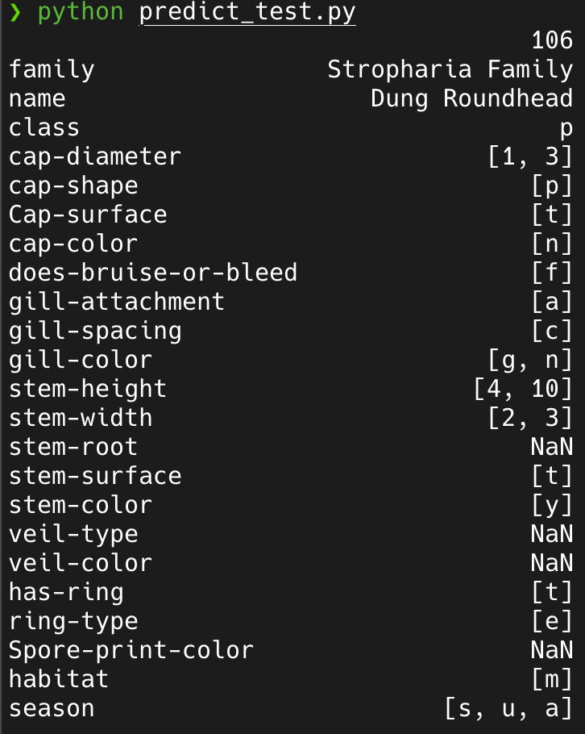

# 🍄 fungiIncognita - Mushroom Classification 🍄‍🟫

04.11.2024 - 26.11.2024

Author: Till Meineke

<div style="text-align:center;">
  
</div>

source: [Giphy](https://i.giphy.com/media/v1.Y2lkPTc5MGI3NjExYnJxa2xoY2R0YnVnZGVuaWMzcjVzc3VwNGFmOXl1bTJzM2JjOXFmZCZlcD12MV9pbnRlcm5hbF9naWZfYnlfaWQmY3Q9cw/BPvLYetv28UVFBHCO2/giphy.gif)

> [!IMPORTANT]
>
> Work in progress.
>
> You can rate this version. Basic functionality is working.
>
> Readme is not finished yet. EDA is missing some parts and is unstructured.
>
> You can test the running EB instance with `make test_deploy` or in the provided conda environment with `python predict_test.py`.
>
> <div style="text-align:center;">
> 
> </div>
>
> I made a [video](./images/prediction_working.mp4) of local deployment with docker `make deploy` and testing with `make test_deploy`, but it is not rendering on github.


## Problem description

Walking through the woods collecting mushrooms can be a fun activity. However, it can also be dangerous if you don't know which mushrooms are edible or not. The goal of this project is to build and deploy a model that can predict which mushrooms you picked based on some simple characteristics.

To better understand the problem, I will use the [Classification Mushroom Data 2020](https://visualization.group/data/mushroom/) dataset. The provided primary data describes 173 mushroom species, which can be used for simulating hypothetical mushrooms. Since the provided secondary data contains 61,069 hypothetical mushrooms for __binary classification without names__, I have to generate simulated data with species names.

This will ensure that the generated dataset is of high quality and relevant for the task I am attempting to solve.

## Project structure

```plaintext
├── data
│   ├── raw
│   │   ├── primary_data_edited.csv                 <-- Raw data from paper
│   │   ├── primary_data_meta.txt                   <-- Raw data from paper (description)
│   │   ├── secondary_data_generated.csv            <-- Raw data from paper
│   │   └── secondary_data_meta.txt                 <-- Raw data from paper (description)
│   └── secondary_data_generated_with_names.csv     <-- Generated data
├── images                                          <-- Images for readme and "Learning in public"
├── models
│   └── model_md=20_msl=5.bin                       <-- Trained model
├── notebooks
│   └── 01_eda.ipynb                                <-- Exploratory data analysis
├── references
│   ├── 'Collins Mushroom Miscellany.epub'          <-- Book with mushroom images
│   ├── 'Mushroom data creation.pdf'                <-- Main paper for creating mushroom data
│   ├── 'Mushroom data creation_sup.pdf'            <-- Supplementary material
│   └── mushrooms-collins-gem.pdf                   <-- Book with mushroom images
├── src                                             <-- Source code for use in this project
│   ├── services
│   │   ├── Images                                  <-- Images from book
│   │   ├── Text                                    <-- Text from book
│   │   └── rename_images.py                        <-- Script to rename images
│   ├── __init__.py                                 <-- Python package initializer file
│   ├── data_cat.py                                 <-- Script to categorize data
│   ├── gen_corr_norm.py                            <-- Script to generate correlated and normalized data
│   ├── mushroom_class_fix.py
│   ├── primary_data_gen.py
│   ├── secondary_data_gen.py                       <-- Script to generate secondary data
│   ├── stats_graphics.py
│   ├── text_attr_match.py
│   └── util_func.py
├── .dockerignore                                   <-- Docker ignore file
├── .gitignore                                      <-- Git ignore file
├── Dockerfile                                      <-- Docker file
├── environment.yml                                 <-- Conda environment file
├── LICENSE
├── Makefile
├── Pipfile                                         <-- Pipenv file
├── Pipfile.lock                                    <-- Pipenv lock file
├── predict.py                                      <-- Prediction script
├── predict_test.py                                 <-- Prediction test script
├── README.md                                       <-- The file you are currently reading
└── train.py                                        <-- Training script
```

## Generating synthetic mushroom data

Working with synthetic data, I was asked to consider the following points:

- Clearly document how you generated the synthetic dataset and the reasoning behind its design.
- Provide sufficient context about the dataset and the model you are building for your peers who will review your project.

### Documentation of the data generation process

In the [repository](https://github.com/ghattab/secondarydata) I found several scripts belonging to the paper "Mushroom data creation" by Ghattas et al. (2020). The scripts are written in Python and are used to generate the secondary data. I had to modify the scripts to generate the data with species names.

```python
def write_to_csv(file_name, funghi_entry_list, use_intervals):
    """
    Parameters
    ----------
    file_name: str
    name of the written csv file
    funghi_entry_list: list of FunghiEntry
    list of mushrooms, each element corresponding to one simulated mushroom
    use_intervals: bool
    uses the interval borders as values for the metrical attributes instead of a simulated float value

    Funtionality
    ------------
    writes each simulated mushroom as a line in a csv file
    """

    file = open(file_name, "w")
    if not use_intervals:
#        file.write(data_cat.PRIMARY_DATASET_HEADER.replace("family;name;", "") + "\n")
        file.write(data_cat.PRIMARY_DATASET_HEADER + "\n")
    else:
        file.write(data_cat.DATASET_HEADER_MIN_MAX.replace("name;", "") + "\n")
    for funghi_entry in funghi_entry_list:
#        funghi_str = funghi_entry.is_edible
        funghi_str = funghi_entry.family + ";" + funghi_entry.name + ";" + funghi_entry.is_edible
        for category in funghi_entry.categories:
            funghi_str += ";" + str(category)
        file.write(funghi_str + "\n")
```

### Context of the dataset and the model

The dataset is a synthetic dataset with 61,069 hypothetical mushrooms. The dataset contains 173 species of mushrooms with names and these features:

- `family`
- `class`
- `cap-diameter`
- `cap-shape`
- `cap-surface`
- `cap-color`
- `does-bruise-or-bleed`
- `gill-attachment`
- `gill-spacing`
- `gill-color`
- `stem-height`
- `stem-width`
- `stem-root`
- `stem-surface`
- `stem-color`
- `veil-type`
- `veil-color`
- `has-ring`
- `ring-type`
- `spore-print-color`
- `habitat`
- `season`

## EDA

<!-- Extensive EDA (ranges of values, missing values, analysis of target variable, feature importance analysis) -->

You can find the EDA in this [notebook](./notebooks/01_eda.ipynb) (WIP) and this improved 2nd [notebook](./notebooks/new_eda.ipynb) (WIP).

### Ranges of values

<div style="text-align:center;">
  
</div>

### Missing values

Since we want a __simple model with few features__ to predict the name of the mushroom, we will drop the features with missing values for our first round of modelling.

<!-- FIXME: Add missing values plot,  -->

### Analysis of the target variable

<!-- FIXME: missing -->

### Feature importance analysis

<!-- FIXME: missing -->

## Model training

<!-- Trained multiple models and tuned their parameters. -->

I used a Logistic Regression model and a Decision Tree model. I used Cross-Validation to evaluate the models.

You can train the model with:

```bash
make train
```

or in your conda environment with:

```bash
python train.py
```

or with pipenv:

```bash
pipenv run python "./train.py"
```
if the environment is not activated. You can activate it with:

```bash
pipenv shell

# and run the script
python train.py
```

## Exporting notebook to python script

<!-- The logic for training the model is exported to a separate script -->

See `train.py`. Model is saved in `models` folder.

## Reproducibility

<!-- It's possible to re-execute the notebook and the training script without errors. The dataset is committed in the project repository or there are clear instructions on how to download the data -->

## Model deployment

<!-- odel is deployed (with Flask, BentoML or a similar framework) -->

## Dependency and environment management

<!-- Provided a file with dependencies and used virtual environment. README says how to install the dependencies and how to activate the environment. -->

Preferably, you can use make commands (from Makefile) or directly run scripts from `scr`.
Refer to section below for the descriptions of make commands. Before running it, consider creating
a virtual environment

### Makefile and test example (not fully implemented)

Try out the make commands (see `make help`).

> [!IMPORTANT]
>
> ```bash
> make grow_fungi
> ```
>
> will overwrite the generated data in `data/secondary_data_generated_with_names.csv`.

### Conda environment

Development was done in conda environment [`./environment.yml`](./environment.yml "Conda environment file"). Install with:


```bash
make new_conda_environment
```

or

```bash
conda env create -f environment.yml
```

### Pipenv environment

For the Docker container, I used pipenv. See [Pipfile](./Pipfile "Pipenv file") and [Pipfile.lock](./Pipfile.lock "Pipenv lock file"). You can install and activate the environment with:

```bash
make new_pipenv_environment
```

or

```bash
pipenv install

# for activation
pipenv shell
```

## Containerization

<!-- The application is containerized and the README describes how to build a container and how to run it. -->

Currently, you can find the following docker files:

- [`Dockerfile`](./Dockerfile)

It is used to build an image for running the model. You can build and run the image with:

```bash
make deploy
```

This will start a Flask server on port 9696.

[`predict.py`](./predict.py) is the script that is run when the container starts. It is momentarily configured for testing with docker. You can modify it to test locally without docker, by commenting/uncommenting the following lines:

```python
# MODEL_FILE = "./models/model_md=20_msl=5.bin" # local testing without docker
MODEL_FILE = "./model_md=20_msl=5.bin"  # testing with docker
```

and run with:

```bash
python predict.py
```

<!-- jupyter.Dockerfile builds an image for running notebooks. -->
<!-- `test.Dockerfile` builds an image to run all tests in (make test-docker). -->
<!-- `serve.Dockerfile` build an image to serve the trained model via a REST api. -->
<!-- To ease the serving it uses open source dploy-kickstart module. To find more info about dploy-kickstart click here. -->
<!-- Finally, you can start all services using `docker-compose`: -->
<!-- for example `docker-compose up test` or `docker-compose up serve`. -->

<!-- Do you need a notebook for development? Just run docker-compose up jupyter. It will launch a Jupyter Notebook with access to your local development files. -->

## Cloud deployment

<!-- There's code for deployment to cloud or kubernetes cluster (local or remote). There's a URL for testing - or video/screenshot of testing it. -->

### EB deployment

EB is running under `fungi-classifier.eba-rpcwcrqg.eu-central-1.elasticbeanstalk.com`

Try with:

```bash
make test_deploy
```

## Web application (not fully implemented)

I created a web application to classify mushrooms. The user can enter the characteristics of the mushroom.
<!--FIXME: or generate a random mushroom -->

The application will then classify the mushroom species and provide the user with full information about the species and a picture for reference.

Start app with:

```bash
streamlit run app.py
```

and open browser at `http://localhost:8501`.

Docker implementation is pending.
