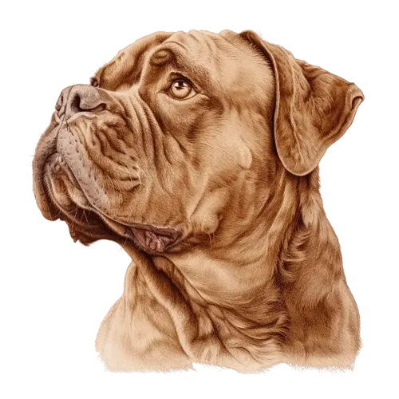
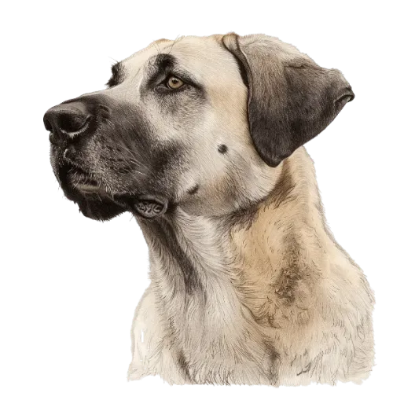

# 🐶 helloListenDog - Dog breed object detection 🐕

Capstone project for [ML zoomcamp cohort 2024](https://github.com/DataTalksClub/machine-learning-zoomcamp)

13.12.2024 - 07.01.2025

Author: Till Meineke

> [!IMPORTANT]
>
> **Work in progress.** (For questions, bugs, hints and improvements just [eMail](mailto:till.meineke@googlemail.com "till.meineke@googlemail.com") me)
>
> Missing parts: see [Deliverables](#deliverables)
>
> You can rate this version. FIXME: Basic functionality is not working until now. I [trained](./notebooks/02b_train_yolo11_object_detection_on_custom_dataset.ipynb) a very rudimentary model with a small dataset, but deployment is still work in progress. Just finished to prepare the final dataset (with annotations), but still having trouble figuring out which model needs which data format.
>
<!-- > You can test the running EB instance with `make test_deploy` or in the provided conda environment with `python predict_test.py`.
>
> I will make a [video](./images/prediction_working.mp4) of deployment with docker `make deploy` and testing with `make test_deploy`.

 -->

## Deliverables

For a project, the repository/folder should contain the following:

- `README.md` with
  - [x] Description of the problem
    - [x] 2 points: Problem is described in README with enough context, so it's clear what the problem is and how the solution will be used
  - [ ] Instructions on how to run the project
- Data
  - [x] You should either commit the dataset you used or have clear instructions how to download the dataset
- Notebook (suggested name - `notebook.ipynb`) with
  - [x] Data preparation and data cleaning
  - [ ] EDA, feature importance analysis
    - [ ] 0 points: No EDA
    - [ ] 1 point: Basic EDA (looking at min-max values, checking for missing values)
    - [ ] 2 points: Extensive EDA (ranges of values, missing values, analysis of target variable, feature importance analysis) For images: analyzing the content of the images. For texts: frequent words, word clouds, etc
  - [ ] Model selection process and parameter tuning
    - [ ] adapt custom YOLO11 model with a training notebook to run on macOS with Metal programming framework
- Script `train.py` (suggested name)
  - [ ] Training the final model
    - [ ] 0 points: No model training
    - [x] 1 point: Trained only one model, no parameter tuning
    - [ ] 2 points: Trained multiple models (linear and tree-based). For neural networks: tried multiple variations - with dropout or without, with extra inner layers or without
    - [ ] 3 points: Trained multiple models and tuned their parameters. For neural networks: same as previous, but also with tuning: adjusting learning rate, dropout rate, size of the inner layer, etc.
  - [ ] Saving it to a file (e.g. pickle) or saving it with specialized software (BentoML)
    - [ ] 0 points: No script for training a model
    - [ ] 1 point: The logic for training the model is exported to a separate script
- [ ] Reproducibility
  - [ ] 0 points: Not possible to execute the notebook and the training script. Data is missing or it's not easily accessible
  - [ ] 1 point: It's possible to re-execute the notebook and the training script without errors. The dataset is committed in the project repository or there are clear instructions on how to download the data
- Script `predict.py` (suggested name)
  - [ ] Loading the model
  - [ ] Serving it via a web service (with Flask or specialized software - BentoML, KServe, etc)
    - [ ] 0 points: Model is not deployed
    - [ ] 1 point: Model is deployed (with Flask, BentoML or a similar framework)
- Files with dependencies
  - [ ] `Pipenv` and `Pipenv.lock` if you use Pipenv
  - [x] or equivalents: conda environment file, `requirements.txt` or `pyproject.toml`
    - [ ] 0 points: No dependency management
    - [x] 1 point: Provided a file with dependencies (requirements.txt, pipfile, bentofile.yaml with dependencies, etc)
    - [ ] 2 points: Provided a file with dependencies and used virtual environment. README says how to install the dependencies and how to activate the env
- [ ] Dockerfile for running the service
  - [ ] 0 points: No containerization
  - [ ] 1 point: Dockerfile is provided or a tool that creates a docker image is used (e.g. BentoML)
  - [ ] 2 points: The application is containerized and the README describes how to build a contained and how to run it
- Cloud Deployment
  - [ ] URL to the service you deployed or
  - [ ] Video or image of how you interact with the deployed service
    - [ ] 0 points: No deployment to the cloud
    - [ ] 1 point: Docs describe clearly (with code) how to deploy the service to cloud or kubernetes cluster (local or remote)
    - [ ] 2 points: There's code for deployment to cloud or kubernetes cluster (local or remote). There's a URL for testing - or video/screenshot of testing it

## Project description

In Hamburg, Germany, there are many dogs and dog lovers. But also there are dangerous and agressive dogs, called "[Listenhunde](https://www.prometheus.vet/listenhunde/hamburg "Website for quick overview of 'Listenhunde'")". To provide a safe environment for all citizens, it is important to be able to identify these breeds easy and fast.

The goal of this project is to build and deploy an image dog breed object detection model for "Listenhunde".

### Listenhunde

"Listenhunde" are classified acording to the [Hamburg law](./docs/hundegesetz_HH.pdf "Hamburg law for dogs") in three categories:

- **Category 1** contains four breeds, which are always considered as dangerous
- **Category 2** contains all dogs showing inappropriate or severe aggressive behavior towards humans or other animals, independent of their breed (possible update: 2nd model to to detect aggressive behavior)
- **Category 3** contains eleven breeds, which are considered as refutably dangerous.

The four dog breeds belonging to **Category 1** are depicted below:

The eleven dog breeds belonging to **Category 3** are depicted below:

### Model selection

The model should be able to detect dogs in an image, video or camera stream and predict, if the breed belongs to category 1 or category 3. For privacy reasons, the model should be able to detect human faces to blur them out. The model should be able to run on a mobile device, like a smartphone <!-- [Object Detection with YOLOv5 on iOS](https://github.com/pytorch/ios-demo-app/tree/master/ObjectDetection)--> or a Raspberry Pi <!--[Real Time Inference on Raspberry Pi 4 (30 fps!)](https://pytorch.org/tutorials/intermediate/realtime_rpi.html) -->, but also on a server (project scope).

#### Why object detection?

To efficiently detect and classify multiple objects in an image, we need object detection. This is a computer vision technique that allows us to identify and locate multiple objects within an image, classifying each object. Object detection also opens up the possibility to track objects in a video or camera stream.

In case of dog breed detection, object detection is the best choice, because it allows us to detect and classify multiple dogs in an image simultaneously.

##### Object detection vs. image classification

- **Image classification** is the task of assigning a label to an image from a fixed set of categories. It is a single-label classification task, where the goal is to predict the class of an image.
- **Object detection** is the task of detecting and classifying multiple objects in an image. It is a multi-label classification task, where the goal is to predict the class of each (or selected) objects in the image simultaneously.

In the ML Zoomcamp course, we focused on image classification, but did not cover object detection. Unlike image classification, object detection requires a labeled dataset with bounding boxes for each object / class to be detected. The architecture of the models is different, because the model must predict the class of each object and the bounding box coordinates.

The most popular object detection models are based on the YOLO (acronym for: "you only look once") and SSD (Single Shot MultiBox Detector) architectures. The accuracy of object detection models is measured using the mean Average Precision (**mAP**) metric, which combines precision and recall to evaluate the performance of the model. The mAP scores of object detection models are usually lower than image classification models. **IoU** (Intersection over Union) is another important metric for object detection models, which measures the overlap between the predicted and ground truth bounding boxes. Another important metric for object detection models is the **inference time**, which measures how fast the model can process an image.

##### Reference Neural Network Models for Object Detection

To test the capabilities of the new [Raspberry Pi AI Camera](https://developer.aitrios.sony-semicon.com/en/raspberrypi-ai-camera) (probably fully realized in later projects, due to time constrains - my camera arrived on Dec 7th 2024), I want to restrict the model selection to the precompiled and ready to deploy [AI models](https://developer.aitrios.sony-semicon.com/en/raspberrypi-ai-camera/develop/ai-models) provided by Sony/AITRIOS (see also on [Github](https://github.com/raspberrypi/imx500-models)).

> - **Task:** Identify and locate multiple objects within an image by classifying each object.
> - **Training dataset**: `COCO`. Designed to encourage research on a wide variety of object categories and is commonly used for benchmarking computer vision models. It comprises of [80 classes](https://github.com/raspberrypi/picamera2/blob/main/examples/imx500/assets/coco_labels.txt).
>
> | Model | [mAP] Accuracy - Quantized(Float) | Input Resolution | [Picamera2](https://github.com/raspberrypi/picamera2/tree/main/examples/imx500) Example Script |
> |---|---|---|---|
> | [SSD MobileNetV2 FPN Lite (pp*)](https://roboflow.com/model/mobilenet-ssd-v2) | **0.218** (0.219) | 320x320 | `python imx500_object_detection_demo.py --model /usr/share/imx500-models/imx500_network_ssd_mobilenetv2_fpnlite_320x320_pp.rpk` |
> | [Efficientdet Lite-0 (pp*)](https://roboflow.com/model/efficientdet-tensorflow-2) | **0.252** (0.2518)​ | 320x320 | `python imx500_object_detection_demo.py --model /usr/share/imx500-models/imx500_network_efficientdet_lite0_pp.rpk --bbox-normalization -r` |
> | [NanoDet-Plus-m-1.5x-416](https://github.com/RangiLyu/nanodet/tree/main) | **0.332**​ (0.3316) | 416x416 | `python imx500_object_detection_demo.py --model /usr/share/imx500-models/imx500_network_nanodet_plus_416x416.rpk # --ignore-dash-labels --postprocess nanodet` |
> | Nanodet Plus (pp*) | **0.32​0** ​(0.3232) | 416x416 | `python imx500_object_detection_demo.py --model /usr/share/imx500-models/imx500_network_nanodet_plus_416x416_pp.rpk # --ignore-dash-labels` |
> | [Yolo v8n (pp*)**](https://roboflow.com/model/yolov8) || 640x640 | `python imx500_object_detection_demo.py --model /usr/share/imx500-models/imx500_network_yolov8n_pp.rpk # --ignore-dash-labels` |
>
> _* pp = post-processing is included in the network and is executed on the IMX500 Edge AI Processor._  
> _** Removed form [Github](https://github.com/raspberrypi/imx500-models/commits/main/) due to legal issues, but still available in older commits._

[Ultralytics YOLOv11](https://github.com/ultralytics/ultralytics) is the latest cutting-edge, state-of-the-art (SOTA) model that builds upon the success of previous YOLO versions and introduces new features and improvements to further boost performance and flexibility. YOLOv11 is designed to be fast, accurate, and easy to use, making it an excellent choice for a wide range of object detection and tracking tasks and is [reported](https://www.raspberrypi.com/news/deploying-ultralytics-yolo-models-on-raspberry-pi-devices/) to run on the Raspberry Pi AI Camera.

The Raspberry Pi AI Camera is equipped with the [IMX500 Edge AI Processor](https://www.aitrios.sony-semicon.com/edge-ai-devices/imx500), which is capable of running AI models on the edge, but has the limitation of 8388480 bytes for firmware, network weight file, and working memory (see [RaspberryPi AI Camera product brief](./docs/RaspberryPi_ai-camera-product-brief.pdf)).

Compatibility issues and optimization overview are described on the AITRIOS developer [website](https://developer.aitrios.sony-semicon.com/en/raspberrypi-ai-camera/develop/ai-tutorials/compatibility-and-optimization-tutorial?version=2024-11-21&progLang=). They also provide a [guide](https://developer.aitrios.sony-semicon.com/en/raspberrypi-ai-camera/develop/ai-tutorials/prepare-and-deploy-ai-models-tutorial?version=2024-11-21&progLang=) to prepare and deploy AI models on the Raspberry Pi AI Camera, as well as a tutorial ([github](https://github.com/SonySemiconductorSolutions/aitrios-rpi-tutorials-ai-model-training/blob/main/notebooks/nanodet-ppe/custom_nanodet.ipynb) / [google colab](https://colab.research.google.com/github/SonySemiconductorSolutions/aitrios-rpi-tutorials-ai-model-training/blob/main/notebooks/nanodet-ppe/custom_nanodet.ipynb)) for retraining the [NanoDet Plus m 1.5x 416](https://github.com/RangiLyu/nanodet/tree/main) for object detection, [exporting Ultralytics YOLOv8n models](https://docs.ultralytics.com/integrations/sony-imx500/), and a tutorial for [model optimization](https://github.com/sony/model_optimization/tree/main/tutorials) with the Model Compression Toolkit ([MCT](https://github.com/sony/model_optimization)).

[NanoDet Benchmark](https://github.com/RangiLyu/nanodet/blob/main/README.md#benchmarks):

> |Model|Resolution|mAPval 0.5:0.95 |CPU Latency (i7-8700)|ARM Latency (4xA76)|FLOPS|Params|Model Size|
> |:-:|:-:|:-:|:-:|:-:|:-:|:-:|:-:|
> |NanoDet-Plus-m-1.5x | 416*416 | 34.1 | 11.50ms | 25.49ms|2.97G|2.44M|4.7MB(FP16) &#124; 2.3MB(INT8)|

[Ultralytics YOLOv8n Benchmark on IMX500](https://github.com/ultralytics/ultralytics/blob/main/docs/en/integrations/sony-imx500.md#benchmarks):
> YOLOv8 benchmarks below were run by the Ultralytics team on Raspberry Pi AI Camera with `imx` model format measuring speed and accuracy.
>
> | Model | Format | Status | Size (MB) | mAP50-95(B) | Inference time (ms/im) |
> |:-:|:-:| :-: | :-: | :-:| :-: |
> | YOLOv8n | imx | ✅ | 2.9 | 0.522 | 66.66 |

> [!NOTE]
> >
> > Validation for the above benchmark was done using [coco8](https://docs.ultralytics.com/datasets/detect/coco8/) dataset

Ultralytics recommends for best results, to ensure the YOLOv8/YOLOv11 model is well-prepared for export by following their [Model Training Guide](https://docs.ultralytics.com/modes/train/), [Data Preparation Guide](https://docs.ultralytics.com/datasets/), and [Hyperparameter Tuning Guide](https://docs.ultralytics.com/guides/hyperparameter-tuning/). Ultralytics also supports other [models](https://docs.ultralytics.com/models/) and various [export formats](https://docs.ultralytics.com/modes/export/#export-formats), like [TF Lite](https://docs.ultralytics.com/integrations/tflite/) (as our server example in ML Zoomcamp), [CoreML](https://docs.ultralytics.com/integrations/coreml/) (for iOS/macOS apps) or [IMX500](https://docs.ultralytics.com/integrations/sony-imx500/) (for Raspberry Pi AI Camera).

[Baidu's RT-DETR, a Vision Transformer-Based Real-Time Object Detector](./docs/DETR_beats_YOLO2304.08069v3.pdf) seems like another interesting model architecture to test (faster and more accurate compared against YOLO), but support or deployment on the Raspberry Pi AI Camera is not yet documented.

I started with training a custom YOLO11 model with a training notebook provided by [Roboflow](https://github.com/roboflow-ai/notebooks/blob/main/notebooks/train-yolo11-object-detection-on-custom-dataset.ipynb), to test my dataset and to get a feeling for the training process and data preparation. This notebook is optimized for training on Google Colab (select GPU runtime), but can be adapted for local training (on macOS you can use the MPS backend for training with Metal programming framework, see [here](https://pytorch.org/docs/stable/notes/mps.html)).

### Data collection, labeling and preprocessing

The model will be trained on a dataset of dog images with corresponding labels.

This being my first object detection project, having no experience with generating a labeled dataset, I started looking for dog breed image datasets on Kaggle and found two promising datasets:

1. [143 Different Dog Breeds image Classification](https://www.kaggle.com/datasets/rafsunahmad/143-different-dog-breeds-image-classifier "143 Different Dog Breeds image Classification")
2. [Stanford Dogs Dataset](http://vision.stanford.edu/aditya86/ImageNetDogs/)

This already gave me ca. 100 - 250 images for 9 out of the 15 dog breeds in the "Listenhunde" category 1 and 3.

The notebook [Train YOLO11 Object Detection on Custom Dataset](./notebooks/train_yolo11_object_detection_on_custom_dataset.ipynb) from Roboflow ()

|Example Image|dog breed|FCI classification|HR classification|HundeG classification|[Stanford Dogs Dataset](http://vision.stanford.edu/aditya86/ImageNetDogs/) / [Kaggle Find my Dog](./docs/FindMyDog_Kaggle_120breeds.md)  [# img]|[143 Different Dog Breeds](./docs/143_Different_Dog_Breeds_Kaggle.md) [# img]|annotated Dataset v1  [# dogs]|[hundund.de](https://www.hundund.de/hunderassen/) [# img]|
| :-: | :- | :-: | :- | :-: | :-: | :-: | :-: | :-: |
|| American Pit Bull Terrier |-|Terrier vom Kampfhundtyp|1|-|99|142|-|
|| American Staffordshire Terrier ||Terrier vom Kampfhundtyp|1|164|100*|171|-|
|| Bordeaux-Dogge ||Doggen und Doggenartige|3|-|100|120|-|
|| Bullmastiff ||Doggen und Doggenartige|3|156|100*|166|-|
|| Bullterrier ||Terrier vom Kampfhundtyp|1|-|100|99|-|
|| Dogo Argentino | gr. 2, sec. 2.1 Doggenartige Hunde | Doggen und Doggenartige | 3 |-|-|7|146 / 209|
|| Fila Brasileiro ||Doggen und Doggenartige|3|-|-|0|91 / 93|
|| Kangal||Bauern-, Hirten- und Treibhunde|3|-|-|0|106 / 108 |
|| Kaukasische Owtscharka (Kavkazskaia Ovtcharka)||Bauern-, Hirten- und Treibhunde|3|-|-|2|155 / 296|
|| Mastiff ||Doggen und Doggenartige|3|-|100|88|-|
|| Mastín Español | gr. 2, sec. 2.2 Berghunde|Bauern-, Hirten- und Treibhunde | 3 |-|-|0|52 / 52|
|| Mastino Napoletano ||Doggen und Doggenartige|3|-|100|120|-|
|| Rottweiler||Bauern-, Hirten- und Treibhunde|3|152|-|151|-|
|| Staffordshire Bull Terrier ||Terrier vom Kampfhundtyp|1|155|-|164|-|
|| Tosa Inu |gr. 2, sec 2.1|Doggen und Doggenartige|3|-|-|0|121 / 121|
|extra classes:|||||||||
|🐶|other dog breed|-||-|-|-|36|-|
||||||||||
|👱|human face|-||-|-|-|45|-|
|🚶‍➡️|person|-||-|-|-|92|-|

_* = not used_

Categorization of dog breeds according to "Enzyklopädie_der_Rassehunde_Band 1 & 2" by Hans Räber. Descriptions provided in `/docs/dog_breeds`.

Bauern-, Hirten- und
Treibhunde

- Mastín Español
- Kangal
- Kaukasische Owtscharka (Kavkazskaia Ovtcharka)
- Rottweiler

Doggen und Doggenartige

- Bullmastiff
- Bordeaux-Dogge
- Dogo Argentino
- Fila Brasileiro
- Mastiff
- Mastino Napoletano
- Tosa Inu

Terrier  
Terrier vom Kampfhundtyp

- American Pit Bull Terrier
- American Staffordshire Terrier
- Bullterrier
- Staffordshire Bull Terrier

<!--
- [COCO Common Objects in Context - Detection Evaluation](https://cocodataset.org/#detection-eval)
- [EfficientDet: Scalable and Efficient Object Detection](https://arxiv.org/abs/1911.09070)
 -->

### Project structure

<!-- FIXME: file tree with exp -->

## EDA
<!-- 1. Dataset Overview: Check dataset size, class distribution, file formats, and missing/corrupted files.
2. Visual Inspection: Randomly view images to check labels, orientation, and quality.
Depending on how comfortable you are with working with images, you can even:
3. Image Properties: Analyze dimensions, aspect ratios, color channels, brightness, and contrast using histograms.
4. Outliers: Use PCA or t-SNE to find anomalous images. -->

### Ranges of values

### Missing values

### Analysis of target variable

### Feature importance analysis

## Model training

## Exporting notebook to python script

## Reproducibility

## Model deployment

## Dependency and environment management

### Makefile

### Conda environment

### Pipenv environment

## Containerization

## Cloud deployment

## EB deployment

## Web application / iOS app

<!--
- [Get started with LiteRT](https://ai.google.dev/edge/litert/inference)
- [Object detection task guide with google mediapipe](https://ai.google.dev/edge/mediapipe/solutions/vision/object_detector#models)
-->

